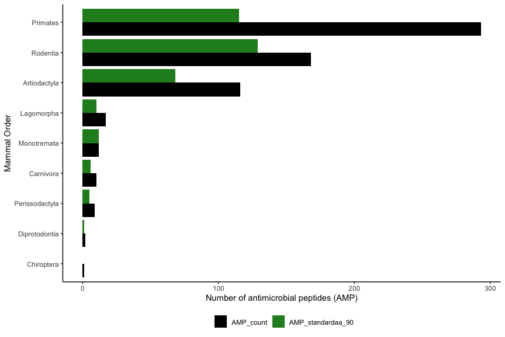

# Datasets for training

Read in the AMPs and non-AMPs from SwissProt (determined by the
“Antimicrobial” keyword, accessed on 24 May 2021). The nonAMPs dataset
was filtered with a sequence threshold of 5 to 500 and contained 452,046
sequences and the NOT operator with Antimicrobial keyword. The AMPs
dataset (unfiltered) contained 3,350 sequences.

``` r
swissprot_amps <- read_tsv("data/uniprot-keywordAntimicrobial+[KW-0929]-filtered-reviewedyes24May21.tab") %>% rename(Entry_name = `Entry name`) %>% mutate(Organism = str_remove(Organism, " \\(.*")) %>% rename(Taxonomic_lineage = `Taxonomic lineage (ALL)`) %>% rename(Order = `Taxonomic lineage (ORDER)`) %>% mutate(Order = str_remove(Order, " \\(.*"))  %>% mutate(Organism = str_replace(Organism, " ", "_"))
```

    ## 
    ## ── Column specification ────────────────────────────────────────────────────────
    ## cols(
    ##   Entry = col_character(),
    ##   `Entry name` = col_character(),
    ##   Status = col_character(),
    ##   `Protein names` = col_character(),
    ##   `Gene names` = col_character(),
    ##   Organism = col_character(),
    ##   Length = col_double(),
    ##   `Keyword ID` = col_character(),
    ##   Keywords = col_character(),
    ##   Proteomes = col_character(),
    ##   Sequence = col_character(),
    ##   `Protein existence` = col_character(),
    ##   `Taxonomic lineage (ORDER)` = col_character(),
    ##   `Taxonomic lineage (ALL)` = col_character()
    ## )

``` r
swissprot_nonamps <- read_tsv("data/uniprot-NOT+keyword_Antimicrobial+[KW-0929]+length[5+TO+500]24May21.tab") %>% rename(Entry_name = `Entry name`) %>% mutate(Organism = str_remove(Organism, " \\(.*")) %>% mutate(Organism = str_replace(Organism, " ", "_"))
```

    ## 
    ## ── Column specification ────────────────────────────────────────────────────────
    ## cols(
    ##   Entry = col_character(),
    ##   `Entry name` = col_character(),
    ##   Status = col_character(),
    ##   `Protein names` = col_character(),
    ##   `Gene names` = col_character(),
    ##   Organism = col_character(),
    ##   Length = col_double(),
    ##   `Keyword ID` = col_character(),
    ##   Keywords = col_character(),
    ##   Proteomes = col_character(),
    ##   Sequence = col_character()
    ## )

Sequences that contained non standard amino acids were removed

``` r
swissprot_amps_standardaa <- swissprot_amps %>% select("Entry_name", "Sequence") %>% as.data.frame() %>% remove_nonstandard_aa()
swissprot_nonamps_standardaa <- swissprot_nonamps %>% select("Entry_name", "Sequence") %>% as.data.frame() %>% remove_nonstandard_aa()
```

Save data to FASTA files to process with CD-HIT

``` r
df_to_faa(swissprot_amps_standardaa, "cache/swissprot_amps_standardaa.fasta")
df_to_faa(swissprot_nonamps_standardaa, "cache/swissprot_nonamps_standardaa.fasta")
```

This command was used on the HPC for both datasets as the nonAMPs file
contained many sequences.

``` bash
cd-hit -i swissprot_nonamps_standardaa.fasta -o swissprot_nonamps_standardaa_90.fasta -c 0.90 -g 1 -T 32 -M 300000
```

``` r
swissprot_amps_standardaa90 <- read_faa("data/swissprot_amps_standardaa_90.fasta") %>% left_join(swissprot_amps, by = c("seq_name" = "Entry_name")) %>% add_column(Label = "Pos") %>% filter(between(Length, 50, 500))

swissprot_nonamps_standardaa90 <- read_faa("data/swissprot_nonamps_standardaa_90.fasta") %>% left_join(swissprot_nonamps, by = c("seq_name" = "Entry_name")) %>% add_column(Label = "Neg") %>% filter(between(Length, 50, 500))
```

## Organisms with the most reviewed AMPs

``` r
swissprot_amps_summary <- swissprot_amps %>%
  mutate(in_90 = Entry_name %in% swissprot_amps_standardaa90$seq_name) %>%
  filter(grepl("Mammalia", Taxonomic_lineage)) %>%
  group_by(Organism) %>% 
  summarise(AMP_count = n(), AMP_standardaa_90 = sum(in_90)) %>%
  arrange(.by_group = TRUE, desc(AMP_count))
```

``` r
ggplot(swissprot_amps_summary %>% pivot_longer(cols = starts_with("AMP")), aes(x = reorder(Organism, value), y = value)) +
  geom_bar(stat = "identity", aes(fill = name), position = "dodge") +
  coord_flip() +
  labs(x = "Mammal species", y = "Number of antimicrobial peptides (AMP)", fill = "") +
  theme_classic() +
  theme(axis.text.y = element_text(face = "italic"),
        legend.position = "bottom") +
  scale_fill_manual(values = c("black", "forestgreen"))
```

<!-- -->

``` r
swissprot_amps %>%
  mutate(in_90 = Entry_name %in% swissprot_amps_standardaa90$seq_name) %>%
  filter(grepl("Mammalia", Taxonomic_lineage)) %>%
  group_by(Order) %>% 
  mutate(Order = replace(Order, is.na(Order), "Afrosoricida")) %>%
  summarise(AMP_count = n(), AMP_standardaa_90 = sum(in_90)) %>%
  arrange(.by_group = TRUE, desc(AMP_count)) %>%
  pivot_longer(cols = starts_with("AMP")) %>%
  ggplot(aes(x = reorder(Order, value), y = value)) +
  geom_bar(stat ="identity", aes(fill = name), position = "dodge") +
  coord_flip() +
  labs(x = "Mammal Order", y = "Number of antimicrobial peptides (AMP)", fill = "") +
  theme_classic() +
  theme(legend.position = "bottom") +
  scale_fill_manual(values = c("black", "forestgreen"))
```

<!-- -->

``` r
group_amps <- swissprot_amps_standardaa90 %>% filter(Organism != "Mus musculus") %>% select("seq_name", "seq_aa", "Label")

group_amps %>% select("seq_name", "seq_aa") %>% df_to_faa("cache/mouse_query.fasta")


group_nonamps <- swissprot_nonamps_standardaa90 %>% filter(Organism != "Mus musculus") %>% select("seq_name", "seq_aa", "Label") %>% slice_sample(n = 10*nrow(group_amps))

group_posandneg <- rbind(group_amps, group_nonamps)

group_features <- group_posandneg %>% calculate_features() %>% mutate(Label = group_posandneg$Label)

saveRDS(group_features, "cache/mouse_features.rds")
```

To

1.  Extract all AMPs excluding the targeted organism
2.  Save AMPs to serve as BLAST query dataset
3.  Extract the negative background set necessary for creating
    classification model
4.  Combine AMPs (positive dataset) and negative dataset
5.  Calculate features on this combined dataset
6.  Save feature dataset

``` r
get_training_and_query_data <- function(organism) {
  
  if(!(organism %in% swissprot_amps_standardaa90$Organism )) {
    
    stop("Organism is not in dataset")
  }
  
  group_amps <- swissprot_amps_standardaa90 %>% filter(Organism != organism) %>% select("seq_name", "seq_aa", "Label")
  
  group_amps %>% select("seq_name", "seq_aa") %>% df_to_faa(paste("cache/", organism, ".fasta", sep = ""))
  
  print("Query database saved")
  
  group_nonamps <- swissprot_nonamps_standardaa90 %>% filter(Organism != organism) %>% select("seq_name", "seq_aa", "Label") %>% 
    slice_sample(n = 10*nrow(group_amps)) 
  
  group_posandneg <- rbind(group_amps, group_nonamps) 
  
  group_features <- group_posandneg %>% calculate_features() %>% mutate(Label = as.factor(group_posandneg$Label))
  
  saveRDS(group_features, paste("cache/", organism, ".rds", sep = ""))
  
  print("Training dataset saved")
}
```

``` r
get_training_and_query_data("Mus_musculus")

get_training_and_query_data("Homo_sapiens")

get_training_and_query_data("Rattus_norvegicus")

get_training_and_query_data("Bos_taurus")
```
