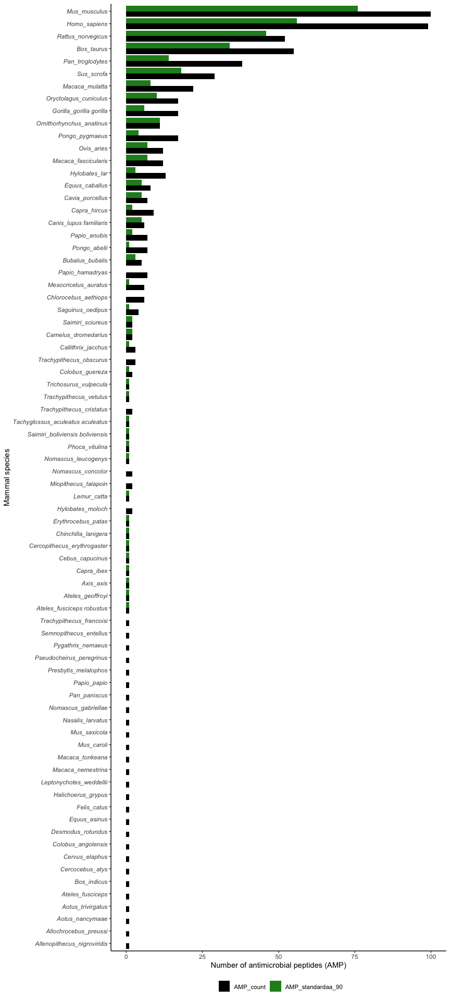
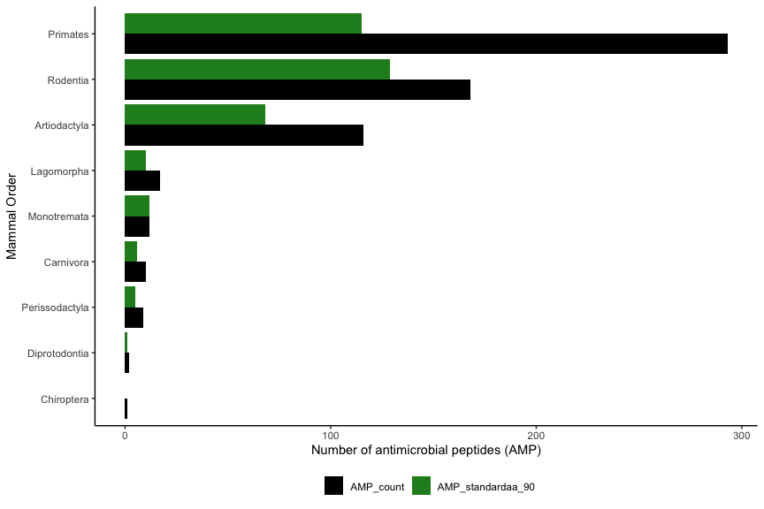
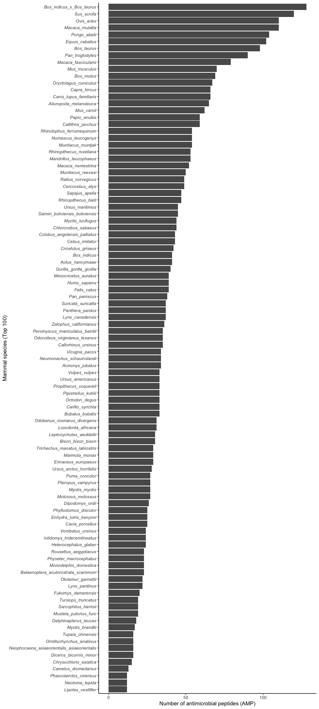
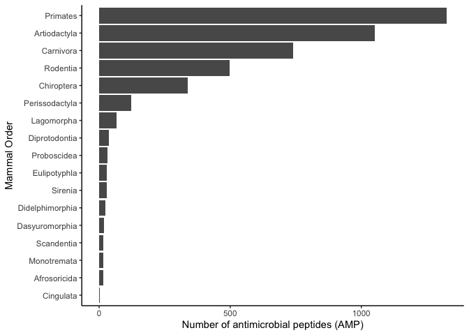

# Datasets for training

Read in the AMPs and non-AMPs from SwissProt (determined by the
“Antimicrobial” keyword, accessed on 24 May 2021). The nonAMPs dataset
was filtered with a sequence threshold of 5 to 500 and contained 452,046
sequences and the NOT operator with Antimicrobial keyword. The AMPs
dataset (unfiltered) contained 3,350 sequences.

``` r
swissprot_amps <- read_tsv("data/uniprot-keywordAntimicrobial+[KW-0929]-filtered-reviewedyes24May21.tab") %>% rename(Entry_name = `Entry name`) %>% mutate(Organism = str_remove(Organism, " \\(.*")) %>% rename(Taxonomic_lineage = `Taxonomic lineage (ALL)`) %>% rename(Order = `Taxonomic lineage (ORDER)`) %>% mutate(Order = str_remove(Order, " \\(.*")) %>% mutate(Organism = str_replace_all(Organism, " ", "_"))

swissprot_nonamps <- read_tsv("data/uniprot-NOT+keyword_Antimicrobial+[KW-0929]+length[5+TO+500]24May21.tab") %>% rename(Entry_name = `Entry name`) %>% mutate(Organism = str_remove(Organism, " \\(.*")) %>% mutate(Organism = str_replace_all(Organism, " ", "_"))
```

Sequences that contained non standard amino acids were removed and the
remaining sequences were saved as FASTA files to process with CD-HIT

``` r
swissprot_amps_standardaa <- swissprot_amps %>% select("Entry_name", "Sequence") %>% as.data.frame() %>% remove_nonstandard_aa()
swissprot_nonamps_standardaa <- swissprot_nonamps %>% select("Entry_name", "Sequence") %>% as.data.frame() %>% remove_nonstandard_aa()

df_to_faa(swissprot_amps_standardaa, "cache/swissprot_amps_standardaa.fasta")
df_to_faa(swissprot_nonamps_standardaa, "cache/swissprot_nonamps_standardaa.fasta")
```

This command was used on the HPC for both datasets as the nonAMPs file
contained many sequences.

``` bash
cd-hit -i swissprot_nonamps_standardaa.fasta -o swissprot_nonamps_standardaa_90.fasta -c 0.90 -g 1 -T 32 -M 300000
```

``` r
swissprot_amps_standardaa90 <- read_faa("data/swissprot_amps_standardaa_90.fasta") %>% left_join(swissprot_amps, by = c("seq_name" = "Entry_name")) %>% add_column(Label = "Pos") %>% filter(between(Length, 50, 500))

swissprot_nonamps_standardaa90 <- read_faa("data/swissprot_nonamps_standardaa_90.fasta") %>% left_join(swissprot_nonamps, by = c("seq_name" = "Entry_name")) %>% add_column(Label = "Neg") %>% filter(between(Length, 50, 500))
```

## Mammals with the most reviewed AMPs

``` r
swissprot_amps_summary <- swissprot_amps %>%
  mutate(in_90 = Entry_name %in% swissprot_amps_standardaa90$seq_name) %>%
  filter(grepl("Mammalia", Taxonomic_lineage)) %>%
  group_by(Organism) %>% 
  summarise(AMP_count = n(), AMP_standardaa_90 = sum(in_90)) %>%
  arrange(.by_group = TRUE, desc(AMP_count))
```

<!-- -->
**Figure 1.1:** Number of reviewed AMPs in the SwissProt database in
mammalian species contrasted with the filtered AMP set used for model
training

<!-- -->
**Figure 1.2:** Number of reviewed AMPs in the SwissProt database in
mammalian orders contrasted with the filtered AMP set used for model
training

## Mammals with the most unreviewed AMPs

``` r
uniprot_amps <- read_tsv("data/uniprot-keywordAntimicrobial+[KW-0929]02July21.tab.gz") %>%
  rename(Entry_name = `Entry name`) %>% mutate(Organism = str_remove(Organism, " \\(.*")) %>% 
  rename(Taxonomic_lineage = `Taxonomic lineage (ALL)`) %>% 
  rename(Order = `Taxonomic lineage (ORDER)`) %>% 
  mutate(Order = str_remove(Order, " \\(.*")) %>%
  mutate(Organism = str_replace_all(Organism, " ", "_")) %>% 
  filter(!grepl("Viruses", Taxonomic_lineage)) %>% 
  filter(!grepl("unclassified", Taxonomic_lineage)) %>%
  mutate(Order = case_when(
    str_detect(Taxonomic_lineage, "Bacteria") ~ "Bacteria",
    str_detect(Organism, "Lates_calcarifer") ~ "Perciformes",
    str_detect(Organism, "Parambassis_ranga") ~ "Perciformes",
    str_detect(Organism, "Larimichthys_crocea") ~ "Acanthuriformes",
    str_detect(Organism, "Amphiprion") ~ "Perciformes",
    str_detect(Organism, "Collichthys_lucidus") ~ "Perciformes",
    str_detect(Organism, "Siganus_canaliculatus") ~ "Perciformes",
    str_detect(Organism, "Parambassis_ranga") ~ "Perciformes",
    str_detect(Organism, "Miichthys_miiuy") ~ "Perciformes",
    str_detect(Organism, "Dicentrarchus_labrax") ~ "Perciformes",
    str_detect(Organism, "Scatophagus_argus") ~ "Perciformes",
    str_detect(Organism, "Biomphalaria_glabrata") ~ "Hygrophila",
    str_detect(Organism, "Stegastes") ~ "Perciformes",
    str_detect(Organism, "Chrysochloris_asiatica") ~ "Afrosoricida",
    str_detect(Organism, "Totoaba_macdonaldi") ~ "Acanthuriformes",
    str_detect(Organism, "Acanthochromis_polyacanthus") ~ "Perciformes",
    str_detect(Organism, "Argyrosomus_regius") ~ "Perciformes",
    str_detect(Organism, "Collichthys_lucidus") ~ "Perciformes",
    str_detect(Organism, "Morone") ~ "Perciformes",
    str_detect(Organism, "Capitella_teleta") ~ "Capitellida",
    str_detect(Organism, "Arenicola_marina") ~ "Capitellida",
    str_detect(Organism, "Naegleria_fowleri") ~ "Schizopyrenida",
    str_detect(Organism, "Dimorphilus_gyrociliatus") ~ "Eunicida",
    str_detect(Organism, "Reticulomyxa_filosa") ~ "Athalamida",
    TRUE ~ Order))
```

``` r
uniprot_amps %>%
  group_by(Order) %>% 
  summarise(AMP_count = n()) %>%
  arrange(.by_group = TRUE, desc(AMP_count)) 
```

    ## # A tibble: 236 x 2
    ##    Order        AMP_count
    ##    <chr>            <int>
    ##  1 Bacteria         18776
    ##  2 Anura             1703
    ##  3 Primates          1618
    ##  4 Brassicales       1329
    ##  5 Artiodactyla      1166
    ##  6 Diptera            855
    ##  7 Carnivora          749
    ##  8 Rodentia           665
    ##  9 Fabales            454
    ## 10 Malvales           432
    ## # … with 226 more rows

<!-- -->

**Figure 1.3:** Number of unreviewed AMPs in the TrEMBL database in the
top 100 best represented mammal species

<!-- -->

**Figure 1.4:** Number of unreviewed AMPs in the TrEMBL database in
mammalian orders

Similar to the reviewed AMPs, the orders Primates, Artiodactyla dominate
the top three orders that have the highest AMP count. However, in the
unreviewed AMPs, Carnivora has topped Rodentia in number of AMPs. In
addition, Chiroptera also appears in the top 5 orders that have the most
number of AMPs in TrEMBL.

Within Carnivora, the domestic dog, [*Canis lupus
familiaris*](https://www.uniprot.org/proteomes/UP000002254) contains the
most AMPs (72). In Chiroptera, the greater horseshoe bat, [*Rhinolophus
ferrumequinum*](https://www.uniprot.org/proteomes/UP000472240) contains
the most AMPs (54). As these organisms contain the most AMPs for their
respective orders, and both contain a reference proteome, these two
species could be good candidates to include in the analysis.

*NOTE: problem with this though as these are in the unreviewed section,
and not well represented in the reviewed AMPs (used for the training and
query data) at all. How to get around this? use unreviewed AMPs instead
for training / query data? or just do normal approach and then these 2
organisms can be used as a decent test for taxonomic bias in
training/query data … (and still have decent number of AMPs to test
effectiveness of the model/BLAST methods )*

``` r
mammal_amps %>% filter(Order == "Carnivora") %>% count(Organism, sort = TRUE) %>% slice_head(n=6)
```

    ## # A tibble: 6 x 2
    ##   Organism                   n
    ##   <chr>                  <int>
    ## 1 Canis_lupus_familiaris    72
    ## 2 Ailuropoda_melanoleuca    65
    ## 3 Ursus_maritimus           45
    ## 4 Felis_catus               40
    ## 5 Lynx_canadensis           37
    ## 6 Panthera_pardus           37

``` r
mammal_amps %>% filter(Order == "Chiroptera") %>% count(Organism, sort = TRUE) %>% slice_head(n=6)
```

    ## # A tibble: 6 x 2
    ##   Organism                      n
    ##   <chr>                     <int>
    ## 1 Rhinolophus_ferrumequinum    54
    ## 2 Myotis_lucifugus             44
    ## 3 Pipistrellus_kuhlii          33
    ## 4 Molossus_molossus            27
    ## 5 Myotis_myotis                27
    ## 6 Pteropus_vampyrus            27

## Extracting data for model training and query searches

The effectiveness of statistical learning (or machine learning)
classification models on finding AMPs was compared with homology. To do
this a training dataset was constructed to train a AMP classification
model for a given organism, which contained all the AMPs in the
SwissProt database **excluding the given organism**, as well as general
protein sequences which exclude AMPs. To perform BLAST searches, a FASTA
file containing *only* the AMPs in the SwissProt database that **exclude
the given organism**.

A function was written that details the abovementioned process which can
be used for any organism in the SwissProt database:

1.  Extract all AMPs excluding the targeted organism
2.  Save AMPs to serve as BLAST query dataset
3.  Extract the negative background set necessary for creating
    classification model
4.  Combine AMPs (positive dataset) and negative dataset
5.  Calculate features on this combined dataset
6.  Save feature dataset

``` r
save_training_and_query_data <- function(organism) {
  
  if(!(organism %in% swissprot_amps_standardaa90$Organism )) {
    
    stop("Organism is not in dataset")
  }
  
  group_amps <- swissprot_amps_standardaa90 %>% filter(Organism != organism) %>% select("seq_name", "seq_aa", "Label")
  
  group_amps %>% select("seq_name", "seq_aa") %>% df_to_faa(paste("cache/", organism, ".fasta", sep = ""))
  
  print("Query database saved")
  
  group_nonamps <- swissprot_nonamps_standardaa90 %>% filter(Organism != organism) %>% select("seq_name", "seq_aa", "Label") %>% 
    slice_sample(n = 10*nrow(group_amps)) 
  
  group_posandneg <- rbind(group_amps, group_nonamps) 
  
  group_features <- group_posandneg %>% calculate_features() %>% mutate(Label = as.factor(group_posandneg$Label))
  
  saveRDS(group_features, paste("cache/", organism, ".rds", sep = ""))
  
  print("Training dataset saved")
}
```

``` r
save_training_and_query_data("Mus_musculus")

save_training_and_query_data("Homo_sapiens")

save_training_and_query_data("Rattus_norvegicus")

save_training_and_query_data("Bos_taurus")

save_training_and_query_data("Pan_troglodytes")

save_training_and_query_data("Sus_scrofa")

save_training_and_query_data("Canis_lupus_familiaris")


# this organism is not in the dataset at all. maybe use ampir precursor model for classification and "data/swissprot_amps_standardaa_90.fasta" as query
save_training_and_query_data("Rhinolophus_ferrumequinum") 
```

*R. ferrumequinum* is not in the dataset. Upon examination of the
SwissProt database, there is only 1 reviewed AMP for the entire
Chiroptera order which is a [lactotransferrin in *Desmodus
rotundus*](https://www.uniprot.org/uniprot/K9IMD0), the Vampire bat,
which is a large AMP (708).

There are 10 reviewed AMPs for Carnivora. Also largely includes largely
secretory fluid AMPs (like lysozymes)

*Save all AMPs (and 10 x random non AMPs) as a general query and
training set to use for R ferrumequinum as this species is not
represented in the dataset*

``` r
df_to_faa(swissprot_amps_standardaa90, "cache/positive_1528AMPs.fasta")

positive_1528AMPs <- swissprot_amps_standardaa90 %>% select("seq_name", "seq_aa", "Label")
negative_15280nonAMPs <- swissprot_nonamps_standardaa90 %>% slice_sample(n = 10*nrow(swissprot_amps_standardaa90)) %>% select("seq_name", "seq_aa", "Label")

posneg1528 <- rbind(positive_1528AMPs, negative_15280nonAMPs)
posneg1528_features <- calculate_features(posneg1528) %>% add_column(Label = as.factor(posneg1528$Label))

saveRDS(posneg1528_features, "cache/pos1528neg15280_feat.rds")
```
