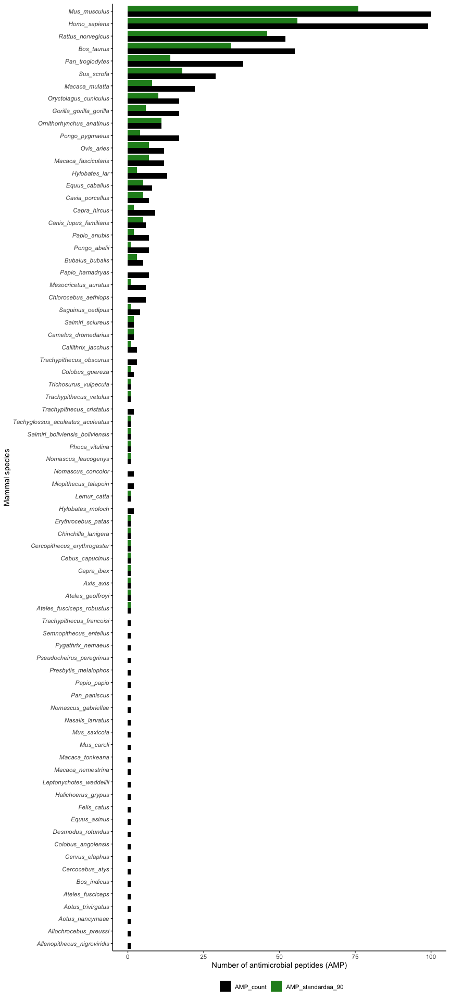
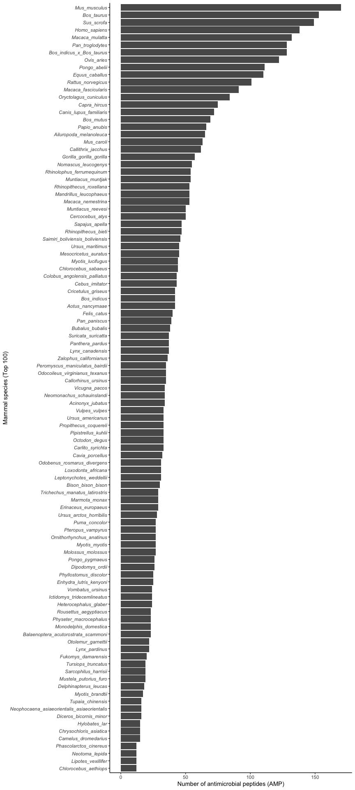
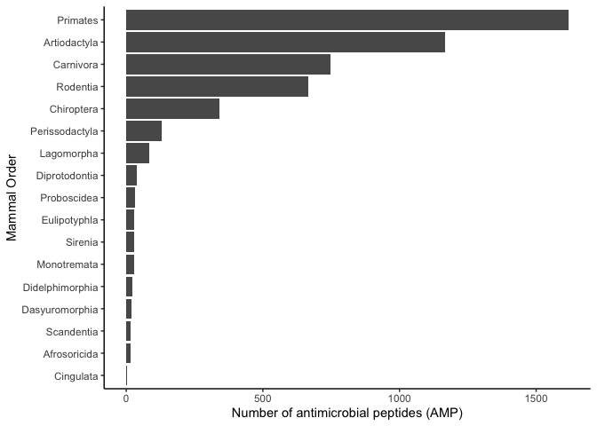

# Datasets for training

Read in the AMPs and non-AMPs from SwissProt (determined by the
“Antimicrobial” keyword, accessed on 24 May 2021). The nonAMPs dataset
was filtered with a sequence threshold of 5 to 500 and contained 452,046
sequences and the NOT operator with Antimicrobial keyword. The AMPs
dataset (unfiltered) contained 3,350 sequences.

``` r
swissprot_amps <- read_tsv("data/uniprot-keywordAntimicrobial+[KW-0929]-filtered-reviewedyes24May21.tab") %>% rename(Entry_name = `Entry name`) %>% mutate(Organism = str_remove(Organism, " \\(.*")) %>% rename(Taxonomic_lineage = `Taxonomic lineage (ALL)`) %>% rename(Order = `Taxonomic lineage (ORDER)`) %>% mutate(Order = str_remove(Order, " \\(.*"))  %>% mutate(Organism = str_replace(Organism, " ", "_"))

swissprot_nonamps <- read_tsv("data/uniprot-NOT+keyword_Antimicrobial+[KW-0929]+length[5+TO+500]24May21.tab") %>% rename(Entry_name = `Entry name`) %>% mutate(Organism = str_remove(Organism, " \\(.*")) %>% mutate(Organism = str_replace(Organism, " ", "_"))
```

Sequences that contained non standard amino acids were removed and the
remaining sequences were saved as FASTA files to process with CD-HIT

``` r
swissprot_amps_standardaa <- swissprot_amps %>% select("Entry_name", "Sequence") %>% as.data.frame() %>% remove_nonstandard_aa()
swissprot_nonamps_standardaa <- swissprot_nonamps %>% select("Entry_name", "Sequence") %>% as.data.frame() %>% remove_nonstandard_aa()

df_to_faa(swissprot_amps_standardaa, "cache/swissprot_amps_standardaa.fasta")
df_to_faa(swissprot_nonamps_standardaa, "cache/swissprot_nonamps_standardaa.fasta")
```

This command was used on the HPC for both datasets as the nonAMPs file
contained many sequences.

``` bash
cd-hit -i swissprot_nonamps_standardaa.fasta -o swissprot_nonamps_standardaa_90.fasta -c 0.90 -g 1 -T 32 -M 300000
```

``` r
swissprot_amps_standardaa90 <- read_faa("data/swissprot_amps_standardaa_90.fasta") %>% left_join(swissprot_amps, by = c("seq_name" = "Entry_name")) %>% add_column(Label = "Pos") %>% filter(between(Length, 50, 500))

swissprot_nonamps_standardaa90 <- read_faa("data/swissprot_nonamps_standardaa_90.fasta") %>% left_join(swissprot_nonamps, by = c("seq_name" = "Entry_name")) %>% add_column(Label = "Neg") %>% filter(between(Length, 50, 500))
```

## Mammals with the most reviewed AMPs

``` r
swissprot_amps_summary <- swissprot_amps %>%
  mutate(in_90 = Entry_name %in% swissprot_amps_standardaa90$seq_name) %>%
  filter(grepl("Mammalia", Taxonomic_lineage)) %>%
  group_by(Organism) %>% 
  summarise(AMP_count = n(), AMP_standardaa_90 = sum(in_90)) %>%
  arrange(.by_group = TRUE, desc(AMP_count))
```

<!-- -->
**Figure 1.1:** Number of reviewed AMPs in the SwissProt database in
mammalian species contrasted with the filtered AMP set used for model
training

<!-- -->
**Figure 1.2:** Number of reviewed AMPs in the SwissProt database in
mammalian orders contrasted with the filtered AMP set used for model
training

<!-- -->

**Figure 1.3:** Number of unreviewed AMPs in the TrEMBL database in the
top 100 best represented mammal species

<!-- -->

**Figure 1.4:** Number of unreviewed AMPs in the TrEMBL database in
mammalian orders

The effectiveness of statistical learning (or machine learning)
classification models on finding AMPs was compared with homology. To do
this a training dataset was constructed to train a AMP classification
model for a given organism, which contained all the AMPs in the
SwissProt database **excluding the given organism**, as well as general
protein sequences which exclude AMPs. To perform BLAST searches, a FASTA
file containing *only* the AMPs in the SwissProt database that **exclude
the given organism**.

A function was written that details the abovementioned process which can
be used for any organism in the SwissProt database:

1.  Extract all AMPs excluding the targeted organism
2.  Save AMPs to serve as BLAST query dataset
3.  Extract the negative background set necessary for creating
    classification model
4.  Combine AMPs (positive dataset) and negative dataset
5.  Calculate features on this combined dataset
6.  Save feature dataset

``` r
save_training_and_query_data <- function(organism) {
  
  if(!(organism %in% swissprot_amps_standardaa90$Organism )) {
    
    stop("Organism is not in dataset")
  }
  
  group_amps <- swissprot_amps_standardaa90 %>% filter(Organism != organism) %>% select("seq_name", "seq_aa", "Label")
  
  group_amps %>% select("seq_name", "seq_aa") %>% df_to_faa(paste("cache/", organism, ".fasta", sep = ""))
  
  print("Query database saved")
  
  group_nonamps <- swissprot_nonamps_standardaa90 %>% filter(Organism != organism) %>% select("seq_name", "seq_aa", "Label") %>% 
    slice_sample(n = 10*nrow(group_amps)) 
  
  group_posandneg <- rbind(group_amps, group_nonamps) 
  
  group_features <- group_posandneg %>% calculate_features() %>% mutate(Label = as.factor(group_posandneg$Label))
  
  saveRDS(group_features, paste("cache/", organism, ".rds", sep = ""))
  
  print("Training dataset saved")
}
```

``` r
save_training_and_query_data("Mus_musculus")

save_training_and_query_data("Homo_sapiens")

save_training_and_query_data("Rattus_norvegicus")

save_training_and_query_data("Bos_taurus")
```
