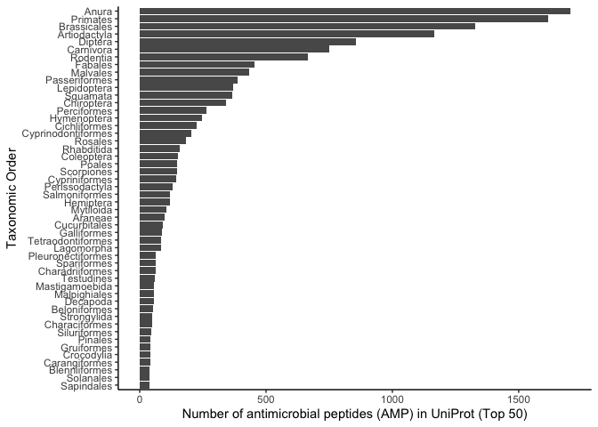
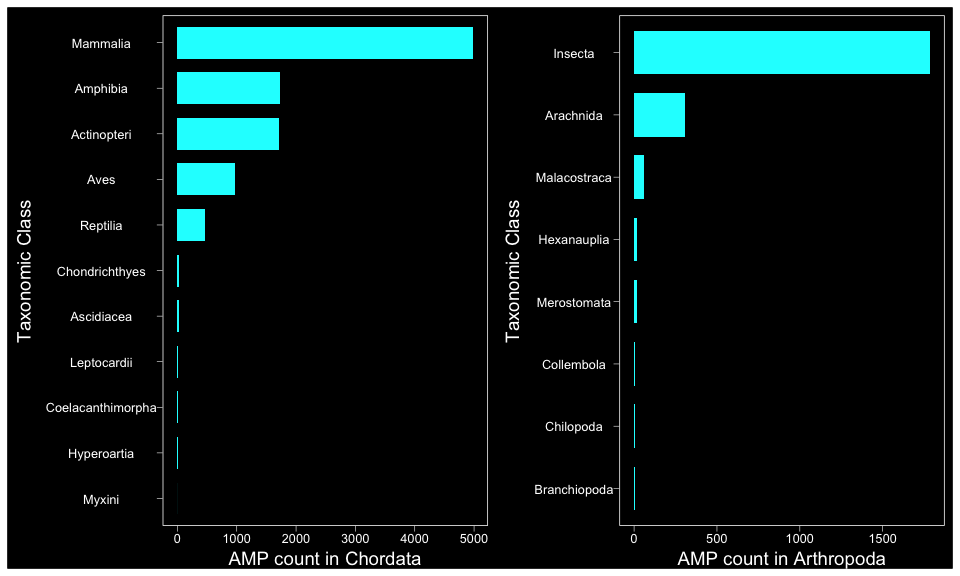
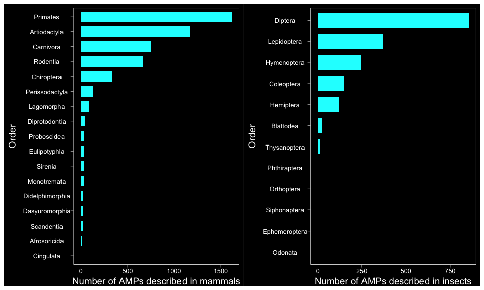
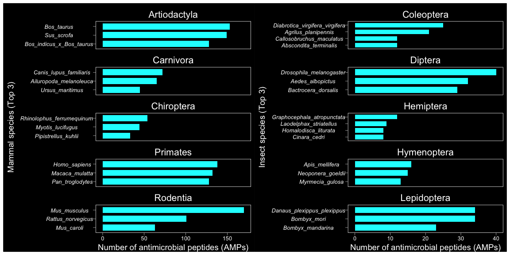
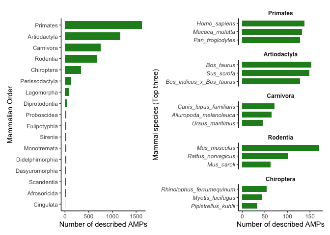
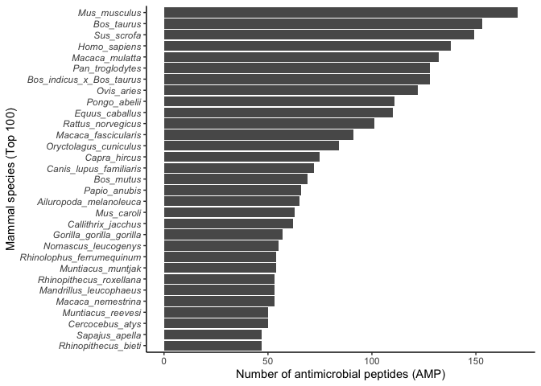

``` r
library(tidyverse)
library(patchwork)
source("scripts/theme_black.R")
```

All Uniprot AMPs were downloaded from UniProt on 02 July 2021 which
included \~20 more reviewed AMPs

``` r
uniprot_amps <- read_tsv("data/uniprot_amps_07Jul21_3371rev42126unrev.tab.gz") %>%
  rename(Entry_name = `Entry name`) %>% mutate(Organism = str_remove(Organism, " \\(.*")) %>% 
  rename(Taxonomic_lineage = `Taxonomic lineage (ALL)`) %>% 
  rename(Order = `Taxonomic lineage (ORDER)`) %>% 
  rename(Phylum = `Taxonomic lineage (PHYLUM)`) %>%
  rename(Class = `Taxonomic lineage (CLASS)`) %>%
  mutate(Order = str_remove(Order, " \\(.*")) %>%
  mutate(Organism = str_replace_all(Organism, " ", "_")) %>% 
  filter(!grepl("Viruses", Taxonomic_lineage)) %>% 
  filter(!grepl("unclassified", Taxonomic_lineage)) %>%
  mutate(label = case_when(str_detect(Taxonomic_lineage, "Bacteria") ~ "Bacteria",
                           str_detect(Taxonomic_lineage, "Archaea") ~ "Archaea",
                               str_detect(Phylum, "Nematoda*") ~ "Nematoda",
                               str_detect(Phylum, "Foraminifera*") ~ "Foraminifera",
                               str_detect(Phylum, "Bryozoa*") ~ "Bryozoa",
                               str_detect(Phylum, "Brachiopoda*") ~ "Brachiopoda",
                               str_detect(Phylum, "Rotifera*") ~ "Rotifera",
                               str_detect(Phylum, "Tardigrada*") ~ "Tardigrada",
                               str_detect(Phylum, "Porifera*") ~ "Porifera",
                                               TRUE ~ Phylum)) %>%
  mutate(Order = case_when(
    str_detect(Organism, "Lates_calcarifer") ~ "Perciformes",
    str_detect(Organism, "Parambassis_ranga") ~ "Perciformes",
    str_detect(Organism, "Larimichthys_crocea") ~ "Acanthuriformes",
    str_detect(Organism, "Amphiprion") ~ "Perciformes",
    str_detect(Organism, "Collichthys_lucidus") ~ "Perciformes",
    str_detect(Organism, "Siganus_canaliculatus") ~ "Perciformes",
    str_detect(Organism, "Parambassis_ranga") ~ "Perciformes",
    str_detect(Organism, "Miichthys_miiuy") ~ "Perciformes",
    str_detect(Organism, "Dicentrarchus_labrax") ~ "Perciformes",
    str_detect(Organism, "Scatophagus_argus") ~ "Perciformes",
    str_detect(Organism, "Biomphalaria_glabrata") ~ "Hygrophila",
    str_detect(Organism, "Stegastes") ~ "Perciformes",
    str_detect(Organism, "Chrysochloris_asiatica") ~ "Afrosoricida",
    str_detect(Organism, "Totoaba_macdonaldi") ~ "Acanthuriformes",
    str_detect(Organism, "Acanthochromis_polyacanthus") ~ "Perciformes",
    str_detect(Organism, "Argyrosomus_regius") ~ "Perciformes",
    str_detect(Organism, "Collichthys_lucidus") ~ "Perciformes",
    str_detect(Organism, "Morone") ~ "Perciformes",
    str_detect(Organism, "Capitella_teleta") ~ "Capitellida",
    str_detect(Organism, "Arenicola_marina") ~ "Capitellida",
    str_detect(Organism, "Naegleria_fowleri") ~ "Schizopyrenida",
    str_detect(Organism, "Dimorphilus_gyrociliatus") ~ "Eunicida",
    str_detect(Organism, "Reticulomyxa_filosa") ~ "Athalamida",
    TRUE ~ Order)) %>%
     mutate(Class = case_when(str_detect(Class, "Lepidosauria*") ~ "Reptilia",
                           str_detect(Order, "Crocodylia") ~ "Reptilia",
                           str_detect(Order, "Testudines") ~ "Reptilia",
                                               TRUE ~ Class))
```

## Taxonomic level: Phylum

<!-- -->

**Figure 1.1:** The number of antimicrobial peptides in phyla across the
UniProt database (excluding Bacteria, Viruses and Archaea)

## Taxonomic level: Class

<!-- -->

**Figure 1.2:** The number of antimicrobial peptides in classes in
chordates (left) and Arthropods (right)

## Taxonomic level: Order

<!-- -->

## Taxonomic level: Species

<!-- -->

**Figure 1.3:** The number of antimicrobial peptides in mammal species
(left) and insect species (right)

<!-- -->

**Figure 1.4:** The number of antimicrobial peptides in frogs and toads
(top 20)

## Fin

``` r
uniprot_amps %>% filter(grepl("Mammalia", Taxonomic_lineage)) %>% 
  group_by(Organism) %>% 
  summarise(AMP_count = n()) %>%
  arrange(.by_group = TRUE, desc(AMP_count)) %>%
  slice_max(order_by = AMP_count, n = 30) %>%
  ggplot(aes(x = reorder(Organism, AMP_count), y = AMP_count)) +
  geom_bar(stat ="identity", position = "dodge") +
  coord_flip() +
  labs(x = "Mammal species (Top 100)", y = "Number of antimicrobial peptides (AMP)", fill = "") +
  theme_classic() +
  theme(axis.text.y = element_text(face = "italic"))
```

<!-- -->

Similar to the reviewed AMPs, the orders Primates, Artiodactyla dominate
the top three orders that have the highest AMP count. However, in the
unreviewed AMPs, Carnivora has topped Rodentia in number of AMPs. In
addition, Chiroptera also appears in the top 5 orders that have the most
number of AMPs in TrEMBL.

Within Carnivora, the domestic dog, [*Canis lupus
familiaris*](https://www.uniprot.org/proteomes/UP000002254) contains the
most AMPs (72). In Chiroptera, the greater horseshoe bat, [*Rhinolophus
ferrumequinum*](https://www.uniprot.org/proteomes/UP000472240) contains
the most AMPs (54). As these organisms contain the most AMPs for their
respective orders, and both contain a reference proteome, these two
species could be good candidates to include in the analysis.

*NOTE: problem with this though as these are in the unreviewed section,
and not well represented in the reviewed AMPs (used for the training and
query data) at all. How to get around this? use unreviewed AMPs instead
for training / query data? or just do normal approach and then these 2
organisms can be used as a decent test for taxonomic bias in
training/query data … (and still have decent number of AMPs to test
effectiveness of the model/BLAST methods )*

``` r
uniprot_amps %>% filter(grepl("Carnivora", Taxonomic_lineage))  %>% count(Organism, sort = TRUE) %>% slice_head(n=6)
```

    ## # A tibble: 6 x 2
    ##   Organism                   n
    ##   <chr>                  <int>
    ## 1 Canis_lupus_familiaris    72
    ## 2 Ailuropoda_melanoleuca    65
    ## 3 Ursus_maritimus           45
    ## 4 Felis_catus               40
    ## 5 Lynx_canadensis           37
    ## 6 Panthera_pardus           37

``` r
uniprot_amps %>% filter(grepl("Chiroptera", Taxonomic_lineage)) %>% count(Organism, sort = TRUE) %>% slice_head(n=6)
```

    ## # A tibble: 6 x 2
    ##   Organism                      n
    ##   <chr>                     <int>
    ## 1 Rhinolophus_ferrumequinum    54
    ## 2 Myotis_lucifugus             44
    ## 3 Pipistrellus_kuhlii          33
    ## 4 Molossus_molossus            27
    ## 5 Myotis_myotis                27
    ## 6 Pteropus_vampyrus            27

Marsupials and Monotremes

``` r
uniprot_amps %>% filter(grepl("Metatheria", Taxonomic_lineage)) %>% count(Organism, sort = TRUE)
```

    ## # A tibble: 6 x 2
    ##   Organism                     n
    ##   <chr>                    <int>
    ## 1 Vombatus_ursinus            24
    ## 2 Monodelphis_domestica       23
    ## 3 Sarcophilus_harrisii        19
    ## 4 Phascolarctos_cinereus      12
    ## 5 Pseudocheirus_peregrinus     1
    ## 6 Trichosurus_vulpecula        1

``` r
uniprot_amps %>% filter(grepl("Monotremata", Taxonomic_lineage)) %>% count(Organism, sort = TRUE)
```

    ## # A tibble: 2 x 2
    ##   Organism                             n
    ##   <chr>                            <int>
    ## 1 Ornithorhynchus_anatinus            27
    ## 2 Tachyglossus_aculeatus_aculeatus     1
