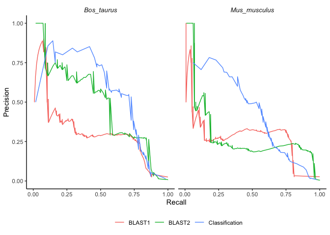

# Using BLAST and AMP prediction models to find AMPs from proteomes

## Proteomes

The proteomes were downloaded from
[UniProt](https://www.uniprot.org/proteomes) on 10 June 2021.

**Table 1:** Proteome information from organisms used as subjects

| Organism Name       | Reference proteome ID                                        | Total proteins | Reviewed | Unreviewed |
|---------------------|--------------------------------------------------------------|----------------|----------|------------|
| *Mus musculus*      | [UP000000589](https://www.uniprot.org/proteomes/UP000000589) | 55,470         | 17,068   | 38,402     |
| *Homo sapiens*      |                                                              |                |          |            |
| *Rattus norvegicus* |                                                              |                |          |            |
| *Bos taurus*        | [UP000009136](https://www.uniprot.org/proteomes/UP000009136) | 37,513         | 6,014    | 31,499     |
|                     |                                                              |                |          |            |

``` r
mouse_proteome <- read_faa("data/proteomes/M_musculus-proteome-UP000000589.fasta.gz")
mouse_proteome_metadata <- read_tsv("data/proteomes/uniprot-organism-Mus+musculus+AND+proteome.tab.gz", col_types = cols()) %>%
  rename("Entry_name" = `Entry name`) %>%
  mutate(Organism = "Mus_musculus") %>% 
  mutate(Label = case_when(str_detect(Keywords, "Antimicrobial") ~ "Pos", TRUE ~ "Neg"))

cow_proteome <- read_faa("data/proteomes/B_taurus-proteome-UP000009136.fasta.gz")
cow_proteome_metadata <- read_tsv("data/proteomes/B_taurus-proteome-UP000009136.tab.gz", col_types = cols()) %>%
  rename("Entry_name" = `Entry name`) %>%
  mutate(Organism = "Bos_taurus") %>% 
  mutate(Label = case_when(str_detect(Keywords, "Antimicrobial") ~ "Pos", TRUE ~ "Neg"))
```

This `UP000000589_10090.fasta.gz` proteome is from the “one protein
sequence per gene” containing 22,001 proteins. This proteome contains
all reviewed AMPs (100) and 20 out of 31 reviewed AMPs. – maybe replace
“full” proteomes with the “unique” proteome and use both reviewed AND
unreviewed AMPs as benchmark result..

``` r
mouse_proteome_1prot <- read_faa("data/proteomes/UP000000589_10090.fasta.gz") %>% mutate(Entry_name = str_extract(seq_name, "(?<=\\|)[a-zA-Z0-9_]*(?=\\s)")) %>% left_join(mouse_proteome_metadata)

mouse_proteome_1prot %>% filter(Status == "reviewed") %>% filter(Label == "Pos") %>% nrow()
```

    ## [1] 100

``` r
mouse_proteome_metadata %>% filter(Status == "reviewed") %>% filter(Label == "Pos") %>% nrow()
```

    ## [1] 100

``` r
mouse_proteome_1prot  %>% filter(Status == "unreviewed") %>% filter(Label == "Pos") %>% nrow()
```

    ## [1] 20

``` r
mouse_proteome_metadata %>% filter(Status == "unreviewed") %>% filter(Label == "Pos") %>% nrow()
```

    ## [1] 31

## BLAST searches to find AMPs

The [BLAST+](https://pubmed.ncbi.nlm.nih.gov/20003500/) version used was
blast 2.11.0, build Nov 17 2020 for MacOS.

Each proteome was used to make a local BLAST database using
`makeblastdb`. This proteome database was then used to query the AMP
dataset with `blastp`, Protein-Protein BLAST 2.11.0+

``` bash
gunzip -dc data/proteomes/M_musculus-proteome-UP000000589.fasta.gz | makeblastdb -in - -title M_musculus-proteome-UP000000589 -dbtype prot -out cache/M_musculus-proteome-UP000000589.fasta
```

``` bash
blastp -db cache/M_musculus-proteome-UP000000589.fasta -query cache/Mus_musculus.fasta -outfmt 6 -max_target_seqs 5 -evalue=10 > data/blastp_results/Mus_musculus.blastp
```

``` bash
gunzip -dc data/proteomes/B_taurus-proteome-UP000009136.fasta.gz | makeblastdb -in - -title B_taurus-proteome-UP000009136 -dbtype prot -out cache/B_taurus-proteome-UP000009136.fasta 

blastp -db cache/B_taurus-proteome-UP000009136.fasta -query cache/Bos_taurus.fasta -outfmt 6 -max_target_seqs 5 -evalue=10 > data/blastp_results/Bos_taurus.blastp
```

BLAST was also performed the other way around, using Mus\_musculus.fasta
as the database and query it against M\_musculus proteome (referred to
as the BLAST2 method) This was done on the HPC. See
[blastAMPsagainstproteome.sh](/scripts/blastAMPsagainstproteome.sh) for
the script used.

1.  qaccver - Query accession.version (AMPs list ID)
2.  saccver - Subject accession.version (Reference proteome ID)
3.  pident - Percentage of identical matches
4.  length - Alignment length (sequence overlap)
5.  mismatch - Number of mismatches
6.  gapopen - Number of gap openings
7.  qstart - Start of alignment in query
8.  qend - End of alignment in query
9.  sstart - Start of alignment in subject
10. send - End of alignment in subject
11. evalue - Expect value (the smaller the evalue, the better the
    homology match)
12. bitscore - Bit score (the higher the bitscore, the better the
    sequence similarity)

``` r
parse_blast_results <- function(blast_results_path, metadata) {
  
  blast_colnames <- c("qaccver","saccver","pident","length","mismatch","gapopen","qstart","qend","sstart","send","evalue","bitscore")
  
  read_tsv(blast_results_path, col_names = blast_colnames) %>% 
  group_by(saccver) %>% 
  slice_max(n = 1, order_by = bitscore) %>%
  separate(saccver, into = c(NA, NA, "Entry_name"), sep = "\\|") %>%
  right_join(metadata, by = "Entry_name") %>% 
  mutate(bitscore = replace_na(bitscore, 0)) %>% # 
  filter(Status == "reviewed")
}

mouse_amps_blast <- parse_blast_results("data/blastp_results/Mus_musculus.blastp", mouse_proteome_metadata)

cow_amps_blast <- parse_blast_results("data/blastp_results/Bos_taurus.blastp", cow_proteome_metadata)
```

*sanity check, remove*

``` r
mouse_amps_blast %>% filter(Label=="Pos") %>% filter(bitscore >= 0.5) %>% n_distinct()
```

    ## [1] 86

``` r
cow_amps_blast %>%   filter(Status == "reviewed") %>% filter(Label == "Pos") %>% n_distinct()
```

    ## [1] 55

*BLAST2 method:*

``` r
blast_colnames <- c("qaccver","saccver","pident","length","mismatch","gapopen","qstart","qend","sstart","send","evalue","bitscore")


mouse_proteome_blast <- read_tsv("data/blastp_results/Mus_musculus_proteome.blastp", col_names = blast_colnames) %>% 
  group_by(qaccver) %>% 
  slice_max(n = 1, order_by = bitscore) %>%
  separate(qaccver, into = c(NA, NA, "Entry_name"), sep = "\\|") %>%
  right_join(mouse_proteome_metadata, by = "Entry_name") %>% 
  mutate(bitscore = replace_na(bitscore, 0)) %>% # 
  filter(Status == "reviewed")


cow_proteome_blast <- read_tsv("data/blastp_results/Bos_taurus_proteome.blastp", col_names = blast_colnames) %>% 
  group_by(qaccver) %>% 
  slice_max(n = 1, order_by = bitscore) %>%
  separate(qaccver, into = c(NA, NA, "Entry_name"), sep = "\\|") %>%
  right_join(cow_proteome_metadata, by = "Entry_name") %>% 
  mutate(bitscore = replace_na(bitscore, 0)) %>% # 
  filter(Status == "reviewed")
```

“For average length proteins, a bit score of 50 is almost always
significant. A bit score of 40 is only significant (E() &lt; 0.001) in
searches of protein databases with fewer than 7000 entries”[Pearson
2013, pp. 4-5](https://doi.org/10.1002/0471250953.bi0301s42)

``` r
max(mouse_proteome_blast$bitscore)
```

    ## [1] 830

``` r
min(mouse_proteome_blast$bitscore)
```

    ## [1] 0

``` r
organisms = c("Mus_musculus","Bos_taurus")

source("scripts/calc_cm_metrics_from_bitscore.R")

get_blast_roc <- function(data, method){
  do.call(rbind,lapply(organisms,function(org){ 
    map_df(seq(0, 1000, 1), calc_cm_metrics_from_bitscore, data %>% filter(Organism==org)) %>%
    add_column(Organism = org)
  })) %>%   
  add_column(Method = method)
}

source("scripts/calc_cm_metrics_from_prob.R")

get_proteome_roc <- function(data, method){
  do.call(rbind,lapply(organisms,function(org){ 
    map_df(c(seq(0.01, 0.99, 0.01),seq(0.99, 0.990, 0.001)), calc_cm_metrics_from_prob, data %>% filter(Organism==org)) %>%
    add_column(Organism = org)
  })) %>%   
  add_column(Method = method)
}
```

``` r
mouse_amps_blast1_roc <- get_blast_roc(mouse_amps_blast, method = "BLAST1")

mouse_proteome_blast2_roc <- get_blast_roc(mouse_proteome_blast, method = "BLAST2")


cow_amps_blast1_roc <- get_blast_roc(cow_amps_blast, method = "BLAST1")

cow_proteome_blast2_roc <- get_blast_roc(cow_proteome_blast, method = "BLAST2")


blast_roc <- rbind(mouse_amps_blast1_roc, mouse_proteome_blast2_roc, cow_amps_blast1_roc, cow_proteome_blast2_roc)

saveRDS(blast_roc, "cache/blast_roc.rds")
```

## Prediction with AMP classification model

``` r
mouse_model <- readRDS("models/Mus_musculus_model.rds")
cow_model <- readRDS("models/Bos_taurus_model.rds")
```

``` r
mouse_pred <- predict_amps(mouse_proteome, n_cores = 2, model = mouse_model)
cow_pred <- predict_amps(cow_proteome, n_cores = 3, model = cow_model)
```

Regex: Three steps to extract the `Entry_name` text that is between a
Unix pipe and a space:

1.  Lookbehind `(?<=\\|)` matches only if preceding character is a Unix
    pipe (\\\|)
2.  Match only alphanumerics and underscores `[a-zA-Z0-9_]*`
3.  Lookahead `(?=\\s)` Matches only if the next character is a space
    (\\s)

``` r
join_pred_with_metadata <- function(pred_data, metadata){
  pred_data %>%
  mutate(Entry_name = str_extract(seq_name, "(?<=\\|)[a-zA-Z0-9_]*(?=\\s)")) %>% 
  select(Entry_name, seq_aa, prob_AMP) %>% 
  left_join(metadata, by = "Entry_name") %>%
  filter(Status == "reviewed")
}
```

``` r
mouse_proteome_pred <- join_pred_with_metadata(mouse_pred, mouse_proteome_metadata)

cow_proteome_pred <- join_pred_with_metadata(cow_pred, cow_proteome_metadata)


proteome_predictions <- rbind(mouse_proteome_pred, cow_proteome_pred) 
```

``` r
pred_roc <- get_proteome_roc(proteome_predictions, "Classification")
```

*combine BLAST and prediction results*

``` r
blast_pred_roc <- rbind(blast_roc, pred_roc)
```

<!-- -->

**Figure 2.1:** Comparison of three different methods on finding AMPs in
different organisms using precision-recall curves. **BLAST1** method is
using the proteome of the organism as a database and a FASTA file that
contains all AMPs in the SwissProt database, *excluding* the subject
organism, as a query. **BLAST2** method is using all AMPs in the
SwissProt database as a database, *excluding* the organism proteome,
which is used as a query. **Classification** method is where a
classification model is trained which contains Swissprot AMPs and
non-AMPs of all organisms *excluding* the target organism, and then
tested on the target organism proteome.
