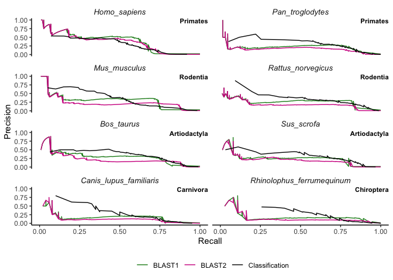

# Using BLAST and AMP prediction models to find AMPs from proteomes

## Proteomes

The proteomes were downloaded from
[UniProt](https://www.uniprot.org/proteomes) on 23 June 2021.

**Table 1:** Proteome information from organisms used as subjects

| Organism Name               | Reference proteome ID                                        | Total proteins | Reviewed | Unreviewed | AMPs (rev) | AMPs (unrev) | Gene count |
|-----------------------------|--------------------------------------------------------------|----------------|----------|------------|------------|--------------|------------|
| *Mus musculus*              | [UP000000589](https://www.uniprot.org/proteomes/UP000000589) | 55,366         | 17,077   | 38,289     | 100        | 31           | 22,001     |
| *Homo sapiens*              | [UP000005640](https://www.uniprot.org/proteomes/UP000005640) | 78,120         | 20,371   | 57,749     | 99         | 16           | 20,600     |
| *Rattus norvegicus*         | [UP000002494](https://www.uniprot.org/proteomes/UP000002494) | 29,934         | 8,131    | 21,803     | 52         | 36           | 21,588     |
| *Bos taurus*                | [UP000009136](https://www.uniprot.org/proteomes/UP000009136) | 37,513         | 6,014    | 31,499     | 55         | 61           | 23,847     |
| *Pan troglodytes*           | [UP000002277](https://www.uniprot.org/proteomes/UP000002277) | 48,770         | 692      | 48,078     | 38         | 27           | 23,053     |
| *Sus scrofa*                | [UP000008227](https://www.uniprot.org/proteomes/UP000008227) | 49,792         | 1,438    | 48,354     | 29         | 46           | 22,165     |
| *Canis lupus familiaris*    | [UP000002254](https://www.uniprot.org/proteomes/UP000002254) | 45,351         | 44,518   | 833        | 6          | 45           | 20,654     |
| *Rhinolophus ferrumequinum* | [UP000472240](https://www.uniprot.org/proteomes/UP000472240) | 33,504         | 27       | 33,477     | 0          | 37           | 19,443     |

``` r
read_proteome_metadata <- function(path, organism) {
  read_tsv(path, col_types = cols()) %>%
  rename("Entry_name" = `Entry name`) %>%
  mutate(Organism = organism) %>% 
  mutate(Label = case_when(str_detect(Keywords, "Antimicrobial") ~ "Pos", TRUE ~ "Neg"))
}

mouse_proteome_metadata <- read_proteome_metadata("data/proteomes/M_musculus-proteome-UP000000589.tab.gz", "Mus_musculus")
cow_proteome_metadata <- read_proteome_metadata("data/proteomes/B_taurus-proteome-UP000009136.tab.gz", "Bos_taurus")
human_proteome_metadata <- read_proteome_metadata("data/proteomes/H_sapiens-proteome-UP000005640.tab.gz", "Homo_sapiens")
rat_proteome_metadata <- read_proteome_metadata("data/proteomes/R_norvegicus-proteome-UP000002494.tab.gz", "Rattus_norvegicus")
chimp_proteome_metadata <- read_proteome_metadata("data/proteomes/P_troglodytes-proteome-UP000002277.tab.gz", "Pan_troglodytes")
pig_proteome_metadata <- read_proteome_metadata("data/proteomes/S_scrofa-uniprot-proteome-UP000008227.tab.gz", "Sus_scrofa")
dog_proteome_metadata <- read_proteome_metadata("data/proteomes/C_familiaris_proteome-UP000002254.tab.gz", "Canis_lupus_familiaris")
bat_proteome_metadata <- read_proteome_metadata("data/proteomes/R_ferrumequinum-proteome-UP000472240.tab.gz", "Rhinolophus_ferrumequinum")
```

This mouse `UP000000589_10090.fasta.gz` proteome is from the “one
protein sequence per gene” containing 22,001 proteins. This proteome
contains all reviewed AMPs (100) and 20 out of 31 unreviewed AMPs. The
cow `B_taurus_UP000009136_9913.fasta.gz` proteome containing 23,847
proteins which contained all reviewed AMPs (55) and 54 out of 61
unreviewed AMPs.

To remove redundancy, the “unique” proteomes were used instead of the
“full” proteomes. As the proteomes used were reference proteomes and
therefore likely accurate, both the reviewed AND unreviewed AMPs were
used as benchmark result..

## BLAST searches to find AMPs

The [BLAST+](https://pubmed.ncbi.nlm.nih.gov/20003500/) version used was
blast 2.11.0, build Nov 17 2020 for MacOS.

Each proteome was used to make a local BLAST database using
`makeblastdb`. This proteome database was then used to query the AMP
dataset with `blastp`, Protein-Protein BLAST 2.11.0+. The
[blast01_proteomeagainstAMPs](scripts/blast01_proteomeagainstAMPs.sh)
script was used for this. This BLAST method is henceforth referred to as
the “BLAST1” method.

``` bash
gunzip -d data/proteomes/M_musculus_UP000000589_10090.fasta.gz 

makeblastdb -in data/proteomes/M_musculus_UP000000589_10090.fasta -dbtype 'prot' 

blastp -db data/proteomes/M_musculus_UP000000589_10090.fasta -query cache/Mus_musculus.fasta -outfmt 6 -max_target_seqs 5 -evalue=10 > data/blastp_results/Mus_musculus2.blastp 

find data/proteomes/ -type f -not -name '*.gz' -delete
```

BLAST was also performed the other way around, using Mus_musculus.fasta
as the database and query it against M_musculus proteome (referred to as
the BLAST2 method) This was done on the HPC. See
[blast02_AMPsagainstproteome.sh](scripts/blast02_AMPsagainstproteome.sh)
for the script used.

The standard BLAST tabular output consists of nine columns:

1.  qaccver - Query accession.version (AMPs list ID)
2.  saccver - Subject accession.version (Reference proteome ID)
3.  pident - Percentage of identical matches
4.  length - Alignment length (sequence overlap)
5.  mismatch - Number of mismatches
6.  gapopen - Number of gap openings
7.  qstart - Start of alignment in query
8.  qend - End of alignment in query
9.  sstart - Start of alignment in subject
10. send - End of alignment in subject
11. evalue - Expect value (the smaller the evalue, the better the
    homology match)
12. bitscore - Bit score (the higher the bitscore, the better the
    sequence similarity)

``` r
parse_blast_results <- function(blast_results_path, metadata) {
  
  blast_colnames <- c("qaccver","saccver","pident","length","mismatch","gapopen","qstart","qend","sstart","send","evalue","bitscore")
  
  read_tsv(blast_results_path, col_names = blast_colnames) %>% 
  group_by(saccver) %>% 
  slice_max(n = 1, order_by = bitscore) %>%
  separate(saccver, into = c(NA, NA, "Entry_name"), sep = "\\|") %>%
  right_join(metadata, by = "Entry_name") %>% 
  mutate(bitscore = replace_na(bitscore, 0))
}

mouse_amps_blast <- parse_blast_results("data/blastp_results/Mus_musculus.blastp", mouse_proteome_metadata)
cow_amps_blast <- parse_blast_results("data/blastp_results/Bos_taurus.blastp", cow_proteome_metadata)
human_amps_blast <- parse_blast_results("data/blastp_results/Homo_sapiens.blastp", human_proteome_metadata)
rat_amps_blast <- parse_blast_results("data/blastp_results/Rattus_norvegicus.blastp", rat_proteome_metadata)
chimp_amps_blast <- parse_blast_results("data/blastp_results/Pan_troglodytes.blastp", chimp_proteome_metadata)
pig_amps_blast <- parse_blast_results("data/blastp_results/Sus_scrofa.blastp", pig_proteome_metadata)
dog_amps_blast <- parse_blast_results("data/blastp_results/Canis_lupus_familiaris.blastp", dog_proteome_metadata)
bat_amps_blast <- parse_blast_results("data/blastp_results/R_ferrumequinum.blastp", bat_proteome_metadata)

blast1results <- rbind(mouse_amps_blast, cow_amps_blast, human_amps_blast, rat_amps_blast, chimp_amps_blast, pig_amps_blast, dog_amps_blast, bat_amps_blast)
```

*BLAST2 method:*

``` r
parse_blast2_results <- function(blast_results_path, metadata) {
  blast_colnames <- c("qaccver","saccver","pident","length","mismatch","gapopen","qstart","qend","sstart","send","evalue","bitscore")
  read_tsv(blast_results_path, col_names = blast_colnames) %>% 
  group_by(qaccver) %>% 
  slice_max(n = 1, order_by = bitscore) %>%
  separate(qaccver, into = c(NA, NA, "Entry_name"), sep = "\\|") %>%
  right_join(metadata, by = "Entry_name") %>% 
  mutate(bitscore = replace_na(bitscore, 0))
}


mouse_proteome_blast <- parse_blast2_results("data/blastp_results/Mus_musculus_proteome.blastp", mouse_proteome_metadata)
cow_proteome_blast <- parse_blast2_results("data/blastp_results/Bos_taurus_proteome.blastp", cow_proteome_metadata)
human_proteome_blast <- parse_blast2_results("data/blastp_results/Homo_sapiens_proteome.blastp", human_proteome_metadata)
rat_proteome_blast <- parse_blast2_results("data/blastp_results/Rattus_norvegicus_proteome.blastp", rat_proteome_metadata)
chimp_proteome_blast <- parse_blast2_results("data/blastp_results/Pan_troglodytes_proteome.blastp", chimp_proteome_metadata)
pig_proteome_blast <- parse_blast2_results("data/blastp_results/Sus_scrofa_proteome.blastp", pig_proteome_metadata)
dog_proteome_blast <- parse_blast2_results("data/blastp_results/Canis_familiaris_proteome.blastp", dog_proteome_metadata)
bat_proteome_blast <- parse_blast2_results("data/blastp_results/R_ferrumequinum_proteome.blastp", bat_proteome_metadata)

blast2results <- rbind(mouse_proteome_blast, cow_proteome_blast, human_proteome_blast, rat_proteome_blast, chimp_proteome_blast, pig_proteome_blast, dog_proteome_blast, bat_proteome_blast)
```

## Prediction with AMP classification model

Read in models

``` r
mouse_model <- readRDS("models/Mus_musculus_model.rds")
cow_model <- readRDS("models/Bos_taurus_model.rds")
human_model <- readRDS("models/Homo_sapiens_model.rds")
rat_model <- readRDS("models/Rattus_norvegicus_model.rds")
chimp_model <- readRDS("models/Pan_troglodytes_model.rds")
pig_model <- readRDS("models/Sus_scrofa_model.rds")
dog_model <- readRDS("models/Canis_familiaris_model.rds")
general_model <- readRDS("models/general_model.rds")
```

Predict AMPs in proteomes

``` r
mouse_pred <- read_faa("data/proteomes/M_musculus_UP000000589_10090.fasta.gz") %>% predict_amps(n_cores = 3, model = mouse_model)
cow_pred <- read_faa("data/proteomes/B_taurus_UP000009136_9913.fasta.gz") %>% predict_amps(n_cores = 4, model = cow_model)
human_pred <- read_faa("data/proteomes/H_sapiens_UP000005640_9606.fasta.gz") %>% predict_amps(n_cores = 4, model = human_model)
rat_pred <- read_faa("data/proteomes/R_norvegicus_UP000002494_10116.fasta.gz") %>% predict_amps(n_cores = 4, model = rat_model)
chimp_pred <- read_faa("data/proteomes/P_troglodytes_UP000002277_9598.fasta.gz") %>% predict_amps(n_cores = 4, model = chimp_model)
pig_pred <- read_faa("data/proteomes/S_scrofa_UP000008227_9823.fasta.gz") %>% predict_amps(n_cores = 4, model = pig_model)
dog_pred <- read_faa("data/proteomes/C_familiaris_UP000002254_9615.fasta.gz") %>% predict_amps(n_cores = 4, model = dog_model)
bat_pred <- read_faa("data/proteomes/R_ferrumequinum_UP000472240_59479.fasta.gz") %>% predict_amps(n_cores = 4, model = general_model)
```

Combine the predictions with metadata

*Regex: Three steps to extract the `Entry_name` text that is between a
Unix pipe and a space:*

*1. Lookbehind `(?<=\\|)` matches only if preceding character is a Unix
pipe (\\\|)* *2. Match only alphanumerics and underscores
`[a-zA-Z0-9_]*` *3. Lookahead `(?=\\s)` Matches only if the next
character is a space (\\s)\*

``` r
join_pred_with_metadata <- function(pred_data, metadata){
  pred_data %>%
  mutate(Entry_name = str_extract(seq_name, "(?<=\\|)[a-zA-Z0-9_]*(?=\\s)")) %>% 
  select(Entry_name, seq_aa, prob_AMP) %>% 
  left_join(metadata, by = "Entry_name")
}
```

``` r
mouse_proteome_pred <- join_pred_with_metadata(mouse_pred, mouse_proteome_metadata)
cow_proteome_pred <- join_pred_with_metadata(cow_pred, cow_proteome_metadata)
human_proteome_pred <- join_pred_with_metadata(human_pred, human_proteome_metadata)
rat_proteome_pred <- join_pred_with_metadata(rat_pred, rat_proteome_metadata)
chimp_proteome_pred <- join_pred_with_metadata(chimp_pred, chimp_proteome_metadata)
pig_proteome_pred <- join_pred_with_metadata(pig_pred, pig_proteome_metadata)
dog_proteome_pred <- join_pred_with_metadata(dog_pred, dog_proteome_metadata)
bat_proteome_pred <- join_pred_with_metadata(bat_pred, bat_proteome_metadata)


proteome_predictions <- rbind(mouse_proteome_pred, cow_proteome_pred, human_proteome_pred, rat_proteome_pred, chimp_proteome_pred, pig_proteome_pred, dog_proteome_pred, bat_proteome_pred) 
```

“For average length proteins, a bit score of 50 is almost always
significant. A bit score of 40 is only significant (E() \< 0.001) in
searches of protein databases with fewer than 7000 entries”[Pearson
2013, pp. 4-5](https://doi.org/10.1002/0471250953.bi0301s42)

``` r
max(blast1results$bitscore)
```

    ## [1] 982

``` r
max(blast2results$bitscore)
```

    ## [1] 982

**Table 2:** Correctly identified AMPs in different proteomes with the
BLAST1, BLAST2 and classification methods.

| Organism                    | AMPs correctly identified | Total AMP count | Method         |
|-----------------------------|---------------------------|-----------------|----------------|
| *Mus musculus*              | 95                        | 132             | BLAST1         |
| *Mus musculus*              | 107                       | 132             | BLAST2         |
| *Mus musculus*              | 68                        | 120             | Classification |
| *Homo sapiens*              | 74                        | 118             | BLAST1         |
| *Homo sapiens*              | 77                        | 117             | BLAST2         |
| *Homo sapiens*              | 62                        | 99              | Classification |
| *Rattus norvegicus*         | 73                        | 89              | BLAST1         |
| *Rattus norvegicus*         | 73                        | 88              | BLAST2         |
| *Rattus norvegicus*         | 62                        | 76              | Classification |
| *Bos taurus*                | 80                        | 116             | BLAST1         |
| *Bos taurus*                | 99                        | 117             | BLAST2         |
| *Bos taurus*                | 83                        | 109             | Classification |
| *Pan troglodytes*           | 52                        | 66              | BLAST1         |
| *Pan troglodytes*           | 52                        | 65              | BLAST2         |
| *Pan troglodytes*           | 49                        | 59              | Classification |
| *Sus scrofa*                | 61                        | 76              | BLAST1         |
| *Sus scrofa*                | 62                        | 77              | BLAST2         |
| *Sus scrofa*                | 48                        | 64              | Classification |
| *Canis lupus familiaris*    | 39                        | 51              | BLAST1         |
| *Canis lupus familiaris*    | 38                        | 51              | BLAST2         |
| *Canis lupus familiaris*    | 30                        | 40              | Classification |
| *Rhinolophus ferrumequinum* | 32                        | 38              | BLAST1         |
| *Rhinolophus ferrumequinum* | 33                        | 39              | BLAST2         |
| *Rhinolophus ferrumequinum* | 26                        | 35              | Classification |

## Calculate metrics for PR curves for BLAST and classification methods

``` r
organisms = c("Mus_musculus","Bos_taurus", "Homo_sapiens", "Rattus_norvegicus", "Pan_troglodytes", "Sus_scrofa", "Canis_lupus_familiaris", "Rhinolophus_ferrumequinum")

source("scripts/calc_cm_metrics_from_bitscore.R")

get_blast_roc <- function(data, method){
  do.call(rbind,lapply(organisms,function(org){ 
    map_df(seq(0, 1000, 1), calc_cm_metrics_from_bitscore, data %>% filter(Organism==org)) %>%
    add_column(Organism = org)
  })) %>%   
  add_column(Method = method)
}

source("scripts/calc_cm_metrics_from_prob.R")

get_proteome_roc <- function(data, method){
  do.call(rbind,lapply(organisms,function(org){ 
    map_df(c(seq(0.01, 0.99, 0.01),seq(0.99, 0.990, 0.001)), calc_cm_metrics_from_prob, data %>% filter(Organism==org)) %>%
    add_column(Organism = org)
  })) %>%   
  add_column(Method = method)
}
```

``` r
blast1roc <- get_blast_roc(blast1results, "BLAST1")

blast2roc <- get_blast_roc(blast2results, "BLAST2")


pred_roc <- get_proteome_roc(proteome_predictions, "Classification")


blast1and2andpred_roc <- rbind(blast1roc, blast2roc, pred_roc)
```

``` r
saveRDS(blast1and2andpred_roc, "cache/blast1and2andpred_roc.rds")
```

Figure colours were tested with a [colorblindness
simulator](http://hclwizard.org:3000/cvdemulator/)

Modify dataframes to add labels with the Orders of the organisms to the
facet plot

``` r
blast1and2andpred_roc <- blast1and2andpred_roc %>% mutate(Organism = factor(Organism, levels = c("Homo_sapiens", "Pan_troglodytes","Mus_musculus" , "Rattus_norvegicus" , "Bos_taurus", "Sus_scrofa", "Canis_lupus_familiaris", "Rhinolophus_ferrumequinum"))) %>% mutate(Order = case_when(
  str_detect(Organism, "Mus") ~ "Rodentia",
  str_detect(Organism, "Rat") ~ "Rodentia",
  str_detect(Organism, "Homo") ~ "Primates",
  str_detect(Organism, "Pan") ~ "Primates",
  str_detect(Organism, "Sus") ~ "Artiodactyla",
  str_detect(Organism, "Bos") ~ "Artiodactyla",
  str_detect(Organism, "Canis") ~ "Carnivora",
  str_detect(Organism, "Rhino") ~ "Chiroptera",
                          TRUE ~ "other")) %>% 
  mutate(Order = factor(Order))
  

figure_text <- tibble(
  Precision = Inf,
  Recall = Inf,
  Organism = unique(blast1and2andpred_roc$Organism),
  label = case_when(
  str_detect(Organism, "Mus") ~ "Rodentia",
  str_detect(Organism, "Rat") ~ "Rodentia",
  str_detect(Organism, "Homo") ~ "Primates",
  str_detect(Organism, "Pan") ~ "Primates",
  str_detect(Organism, "Sus") ~ "Artiodactyla",
  str_detect(Organism, "Bos") ~ "Artiodactyla",
  str_detect(Organism, "Canis") ~ "Carnivora",
  str_detect(Organism, "Rhino") ~ "Chiroptera",
                          TRUE ~ "other")) %>%
  mutate(Organism = factor(Organism, levels = c("Homo_sapiens", "Pan_troglodytes","Mus_musculus" , "Rattus_norvegicus" , "Bos_taurus", "Sus_scrofa", "Canis_lupus_familiaris", "Rhinolophus_ferrumequinum")))
```

``` r
ggplot(blast1and2andpred_roc, aes(x = Recall, y = Precision) ) +
  geom_line(aes(colour = Method)) +
  geom_text(aes(label = label), data = figure_text, check_overlap = TRUE, vjust = "top", hjust = "right", size = 3, fontface = "bold") +
  facet_wrap(~Organism, ncol = 2) +
  theme_classic() +
  theme(legend.position = "bottom",
        strip.background = element_blank(),
        strip.text = element_text(face = "italic",
                                  size = 10)) +
  labs(colour = "") +
  scale_colour_manual(breaks = c("BLAST1", "BLAST2", "Classification"),
                       values = c("forestgreen","violetred", "grey1")) 
```

<!-- -->

**Figure 2.1:** Comparison of three different methods on finding AMPs in
different organisms using precision-recall curves. **BLAST1** method is
using the proteome of the organism as a database and a FASTA file that
contains all AMPs in the SwissProt database, *excluding* the subject
organism, as a query. **BLAST2** method is using all AMPs in the
SwissProt database as a database, *excluding* the organism proteome,
which is used as a query. **Classification** method is where a
classification model is trained which contains Swissprot AMPs and
non-AMPs of all organisms *excluding* the target organism, and then
tested on the target organism proteome.
