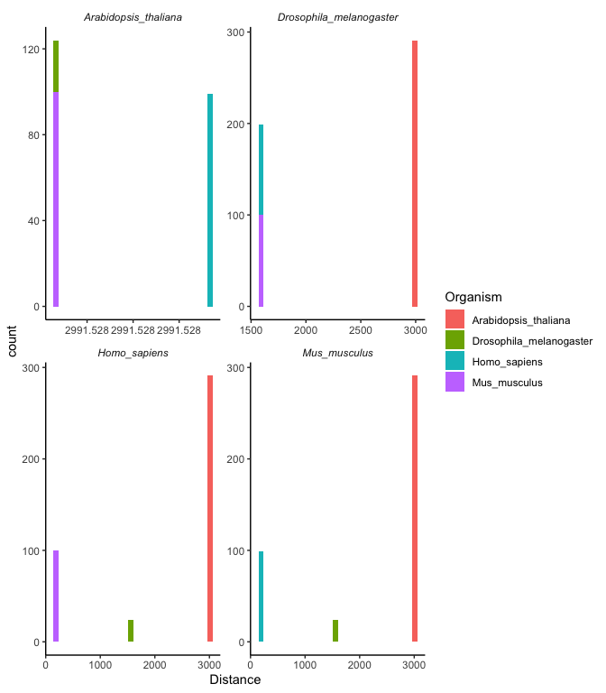
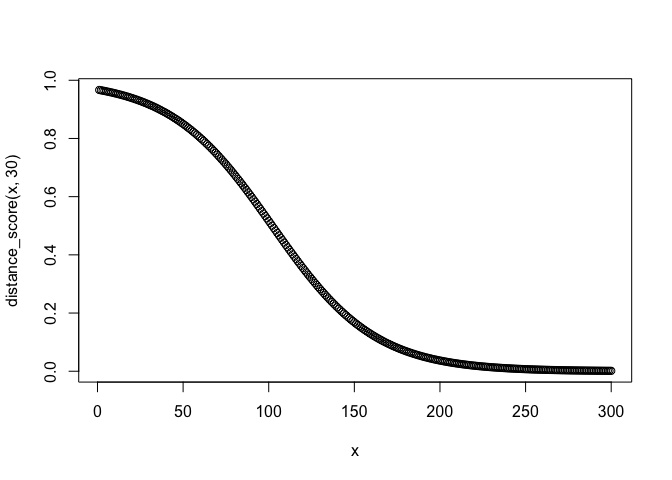
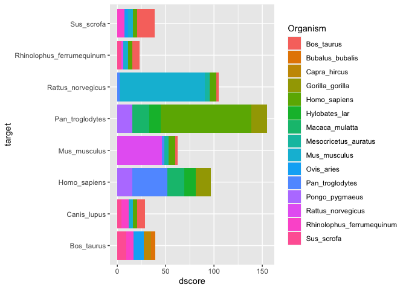
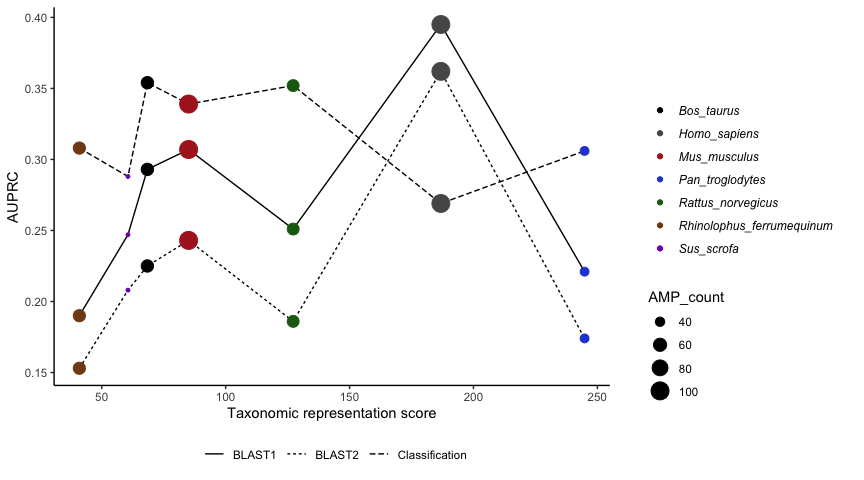
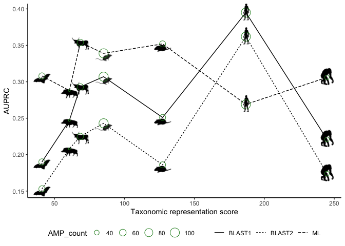

## Prepare AMP and tree datasets

AMPs (3,371 sequences) were obtained from SwissProt on 01 July 2021
[UniProtKB 2021\_03
results](https://www.uniprot.org/uniprot/?query=keyword%3A%22Antimicrobial%20%5BKW-0929%5D%22%20AND%20reviewed%3Ayes&columns=id%2Centry%20name%2Creviewed%2Cprotein%20names%2Cgenes%2Corganism%2Clength%2Ckeyword-id%2Ckeywords%2Cproteome%2Corganism-id%2Clineage(ORDER)%2Csequence%2Cexistence%2Clineage(ALL)&sort=sequence-modified).

Read in the same SwissProt AMPs used for creating the classification
models and BLAST datasets. The organism names were tidied up and made
more compatible to [TimeTree](http://timetree.org/) names where species
only have two names. Viruses were removed. This resulted in 802 unique
organisms. Species not fully defined (e.g. "Lactococcus sp) were
additionally removed. This resulted in 769 species.

Add in the unreviewed horseshoe bat AMPs (used in previous analysis)

Read in the tree from [TimeTree](http://timetree.org/)

Normalise names: 211 organisms had unresolved names of which 76 (mostly
bacteria) were replaced with different names and the remaining 135
organisms potentially were not in the TimeTree database at the time.

After renaming the majority of species in the tree to match to the
species names used in SwissProt, 456 AMP entries remained in SwissProt
where the species could not be found in the TimeTree database. These
mostly includes arachnids (scorpions and spiders), hymenopterans (wasps,
bees, ants and sawflies) and anurans (frogs).

    ## # A tibble: 37 × 2
    ##    `Taxonomic lineage (ORDER)`             n
    ##    <chr>                               <int>
    ##  1 Scorpiones                             98
    ##  2 Hymenoptera                            93
    ##  3 Anura                                  67
    ##  4 Araneae (spiders)                      67
    ##  5 Lepidoptera (butterflies and moths)    15
    ##  6 Coleoptera                             13
    ##  7 Stolidobranchia                        13
    ##  8 Lactobacillales                        10
    ##  9 Fabales                                 9
    ## 10 Poales                                  9
    ## # … with 27 more rows

Convert the tree tibble back to a tree

## Pairwise distances between organisms

Calculate pairwise distances between pairs of tips from the tree using
the branch lengths with
[`cophenetic.phylo`](https://rdrr.io/cran/ape/man/cophenetic.phylo.html)

Convert matrix to dataframe, tidy it, and left join to SwissProt AMPs
dataset (by organism). This results in a long tibble with two columns
that contain organism names. Each row represents the potential
contribution of an AMP (from one organism) to the database of AMPs
available for training models that could potentially be used to predict
amps in a second organism. In this framework we refer to the first
organism using the column `Organism` and the second using the column,
`target`.

## Taxonomic Representation Score

For each `target` organism we could potentially construct a database for
AMP prediction (either via BLAST or ML approaches) using AMPs from all
remaining (non-target) organisms. Our hypothesis is that predictive
performance will be better for target organisms where the remaining
database has a large number of AMPs from closely related taxa. To
capture this effect we propose the following score.

Let

be the  known
AMPs in the proteome of species
, all of which have the
same taxonomic distance,
 to the target
organism. The representation score,
 for target
organism  is then given
by

where  is a parameter
controlling the shape of a sigmoid curve that determines the relative
weighting of AMPs given their taxonomic distance from the target.

In order to choose an appropriate value for
 we examine the
distribution of taxonomic distances for a selection of target organisms

<!-- -->

**Figure 4.1:** **A** Histogram of pairwise distance between each
faceted organism and other selected organisms present in the AMP dataset

Based on this we can see that relatively close taxonomic distances (ie
within mammalia) are around 100, those from mammals to insects are
\~1500 and those from mammals to plants are `>3000`. A value of
 gives
full weight to relatives within the same class (ie mammalia) and rapidly
diminishing weight to more distant relatives.

<!-- -->

<!-- -->

## Taxonomic distance score vs. AUPRC

Read in previously calculated AUPRC values (see
03\_blast\_and\_prediction.Rmd).

Join the AUPRC values and distance metric for each organism

Add AMP count to plot as point size

<!-- -->

**Figure 4.3:** **A** Scatter and line plot of the summed inverse
pairwise distance and the AUPRC for each AMP finding method for AMPs in
different organisms. The size of points depends on the number of AMPs in
the organism, represented by the AMP\_count.

<!-- -->
