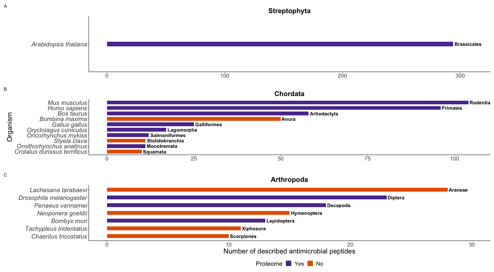

## Starting over with a new AMP database

A new AMP database was constructed which included:

-   the reviewed AMPs from UniProt (accessed 07 July 2021) - 3,242 AMPs
-   the unreviewed AMPs in the UniProt database, if present in the AMP
    databases APD, DRAMP or dbAMP (accessed 09 April 2021) - 170 AMPs
-   Total AMPs: 3,412

This approach is consistent with the creation of ampir’s models and
detailed in [01_collate_databases.md in the AMP_pub
repository](https://github.com/Legana/AMP_pub/blob/master/01_collate_databases.md).

``` r
uniprot_and_amp_dbs_amps <- readRDS("data/uniprot_amps_w_amp_dbsJuly21.rds") %>%
  rename(Entry_name = `Entry name`) %>% 
  mutate(Organism = str_remove(Organism, " \\(.*")) %>% 
  rename(Taxonomic_lineage = `Taxonomic lineage (ALL)`) %>% 
  rename(Order = `Taxonomic lineage (ORDER)`) %>% 
  rename(Phylum = `Taxonomic lineage (PHYLUM)`) %>%
  rename(Class = `Taxonomic lineage (CLASS)`) %>%
  mutate(Order = str_remove(Order, " \\(.*")) %>%
  mutate(Organism = str_replace_all(Organism, " ", "_")) %>%
  ungroup()
```

Removing sequences containing anything other than the standard AA
results in 3,354 sequences

``` r
amps_standardaa <- uniprot_and_amp_dbs_amps %>% select("Entry_name", "Sequence") %>% as.data.frame() %>% remove_nonstandard_aa()
```

Use `cd-hit` to remove highly similar sequences

``` bash
cd-hit -i cache/amps_standardaa.fasta -o cache/amps_standardaa.fasta90.fasta -c 0.90 -g 1
```

``` r
amps_standardaa90 <- read_faa("cache/amps_standardaa.fasta90.fasta") %>% 
  left_join(uniprot_and_amp_dbs_amps, by = c("seq_name" = "Entry_name")) %>%
  filter(between(Length, 50, 500)) %>% 
  add_column(Label = "Pos")
```

`cd-hit` resulted in 2,339 representative sequences. 1635 of these
sequences are between 50 and 500 AA long, which is the length filter
that will be applied to train the classification models.

The phyla Chordata, Arthropoda and Streptophyta contain the most AMPs.
Therefore I want to pick the organism with the most AMPs in each
taxonomic group within these three phyla.

The phyla Evosea and Nematoda both have a single organism (*D.
discoideum* (amoeba) and *C. elegans* (roundworm), respectively) with
around 10 AMPs which could maybe be added to the test. The remaining
phyla only have organisms that have less than 5 AMPs each, so these are
not worth adding.

Notes: How many AMPs present for each *chosen* organism in new training
DB. Use range of taxonomic distances to stretch out distance x axis. 10
borderline, over 20 is good.

``` r
uniprot_and_amp_dbs_amps %>%
  mutate(in_90 = Entry_name %in% amps_standardaa90$seq_name) %>%
  filter(!grepl("Bacteria", Taxonomic_lineage)) %>% 
  filter(!grepl("Viruses", Taxonomic_lineage)) %>%
  group_by(Phylum) %>%
  summarise(AMP_count = n(), AMP_standardaa_90 = sum(in_90)) %>%
  arrange(.by_group = TRUE, desc(AMP_count))
```

    ## # A tibble: 14 × 3
    ##    Phylum                AMP_count AMP_standardaa_90
    ##    <chr>                     <int>             <int>
    ##  1 Chordata                   1747               690
    ##  2 Arthropoda                  685               331
    ##  3 Streptophyta                556               380
    ##  4 Mollusca                     33                16
    ##  5 Evosea                       16                14
    ##  6 Nematoda (roundworms)        15                14
    ##  7 Annelida                     14                10
    ##  8 Ascomycota                   13                10
    ##  9 Cnidaria                     10                 7
    ## 10 Basidiomycota                 8                 1
    ## 11 Echinodermata                 4                 3
    ## 12 Euryarchaeota                 3                 3
    ## 13 Mucoromycota                  1                 0
    ## 14 Platyhelminthes               1                 0

## Chordata

### Organisms with most AMPs according to taxonomic **Class**

-   *Mus musculus* (mammal with 104 AMPs)
-   *Bombina maxima* (toad with 50 AMPs)
-   *Gallus gallus* (bird with 25 AMPs)
-   *Oncorhynchus mykiss* (fish with 12 AMPs)
-   *Styela clava* (tunicate with 11 AMPs)
-   *Crotalus durissus terrificus* (snake with 10 AMPs)

``` r
uniprot_and_amp_dbs_amps %>%
  mutate(in_90 = Entry_name %in% amps_standardaa90$seq_name) %>%
  filter(!grepl("Bacteria", Taxonomic_lineage)) %>% 
  filter(Phylum == "Chordata") %>%
  group_by(Order, Organism, Class) %>%
  summarise(AMP_count = n(), AMP_standardaa_90 = sum(in_90)) %>%
  ungroup() %>%
  group_by(Class) %>%
  slice_max(AMP_count, n = 1) %>%
  arrange(desc(AMP_count)) 
```

    ## # A tibble: 10 × 5
    ## # Groups:   Class [10]
    ##    Order              Organism          Class         AMP_count AMP_standardaa_…
    ##    <chr>              <chr>             <chr>             <int>            <int>
    ##  1 Rodentia           Mus_musculus      Mammalia            104               77
    ##  2 Anura              Bombina_maxima    Amphibia             50                9
    ##  3 Galliformes        Gallus_gallus     Aves                 25               19
    ##  4 Salmoniformes      Oncorhynchus_myk… Actinopteri          12                5
    ##  5 Stolidobranchia    Styela_clava      Ascidiacea           11                4
    ##  6 Squamata           Crotalus_durissu… Lepidosauria…        10                2
    ##  7 Testudines         Pelodiscus_sinen… <NA>                  2                1
    ##  8 Myliobatiformes    Potamotrygon_cf.… Chondrichthy…         1                0
    ##  9 Petromyzontiformes Petromyzon_marin… Hyperoartia           1                0
    ## 10 Amphioxiformes     Branchiostoma_be… Leptocardii           1                1

If taking the top organisms per **Order**, where each organism has at
least 10 AMPs, the following organisms would be candidates:

-   *Mus musculus* (mouse, mammal, 104 AMPs)
-   *Homo sapiens* (human, mammal, 96 AMPs)
-   *Bos taurus* (cattle, mammal, 58 AMPs)
-   *Oryctolagus cuniculus* (rabbit, mammal, 17 AMPs)
-   *Ornithorhynchus anatinus* (platypus, mammal, 11 AMPs )
-   *Bombina maxima* (toad, amphibian, 50 AMPs)
-   *Gallus gallus* (junglefowl, bird, 25 AMPs)
-   *Oncorhynchus mykiss* (fish with 12 AMPs)
-   *Styela clava* (tunicate with 11 AMPs)
-   *Crotalus durissus terrificus* (snake with 10 AMPs)

However, the toad *Bombina maxima*, does not have an available reference
proteome. The only [reference proteomes available for
anurans](https://www.uniprot.org/proteomes/?query=taxonomy%3A%22Anura+%289ANUR%29+%5B8342%5D%22&sort=score)
are: *Xenopus tropicalis* (*Silurana tropicalis*), *Xenopus leavis* and
*Lithobates catesbeianus* (*Rana catesbeiana*) which have 9, 10 and 13
AMPs, respectively. *Lithobates catesbeianus* has the most AMPs of these
three frogs but also has the most missing values (70%) in its reference
proteome BUSCO score.

``` r
uniprot_and_amp_dbs_amps %>%
  mutate(in_90 = Entry_name %in% amps_standardaa90$seq_name) %>% 
  filter(Order == "Anura") %>% 
  group_by(Organism, Order) %>%
  summarise(AMP_count = n(), AMP_standardaa_90 = sum(in_90)) %>% 
  arrange(desc(AMP_count)) %>%
  head(18)
```

    ## # A tibble: 18 × 4
    ## # Groups:   Organism [18]
    ##    Organism                   Order AMP_count AMP_standardaa_90
    ##    <chr>                      <chr>     <int>             <int>
    ##  1 Bombina_maxima             Anura        50                 9
    ##  2 Pelophylax_ridibundus      Anura        24                 0
    ##  3 Rana_dybowskii             Anura        23                 8
    ##  4 Phasmahyla_jandaia         Anura        20                 0
    ##  5 Pithecopus_hypochondrialis Anura        20                 5
    ##  6 Phyllomedusa_sauvagei      Anura        19                 9
    ##  7 Xenopus_ruwenzoriensis     Anura        19                 0
    ##  8 Amolops_jingdongensis      Anura        18                10
    ##  9 Amolops_loloensis          Anura        18                 4
    ## 10 Rana_temporaria            Anura        17                 3
    ## 11 Lithobates_palustris       Anura        16                 3
    ## 12 Odorrana_grahami           Anura        16                 7
    ## 13 Cruziohyla_calcarifer      Anura        15                 3
    ## 14 Pelophylax_lessonae        Anura        15                 2
    ## 15 Phyllomedusa_bicolor       Anura        14                 8
    ## 16 Phyllomedusa_trinitatis    Anura        14                 0
    ## 17 Pithecopus_azureus         Anura        14                 2
    ## 18 Lithobates_catesbeianus    Anura        13                 3

The tunicate, *Styela clava* and the snake *Crotalus durissus
terrificus* do not have a proteome either and the other organisms within
their respective class have less than four known AMPs.

The majority of this list are mammals. The platypus however, is a
monotreme, and not a typical placental (eutherian) mammal, like the
mouse, human, cattle and rabbit are. Monotremes diverged earlier from
the mammalian common ancestor compared to the placental mammals and
subsequently have different characteristics [(Deakin, Graves and Rens
2012)](https://www.karger.com/Article/Fulltext/339433)

``` r
chordata_amps_per_order <- uniprot_and_amp_dbs_amps %>%
  mutate(in_90 = Entry_name %in% amps_standardaa90$seq_name) %>%
  filter(!grepl("Bacteria", Taxonomic_lineage)) %>% 
  filter(Phylum == "Chordata") %>%
  group_by(Order, Organism, Class) %>%
  summarise(AMP_count = n(), AMP_standardaa_90 = sum(in_90)) %>%
  ungroup() %>%
  group_by(Order) %>%
  slice_max(AMP_count, n = 1) %>%
  arrange(desc(AMP_count)) %>%
  head(10) %>% 
  mutate(Organism = str_replace_all(Organism, "_", " ")) %>% 
  add_column(Proteome = c("Yes", "Yes", "Yes", "No", "Yes", "Yes", "Yes", "Yes", "No", "No"))

chordata_amps_per_order
```

    ## # A tibble: 10 × 6
    ## # Groups:   Order [10]
    ##    Order           Organism       Class      AMP_count AMP_standardaa_… Proteome
    ##    <chr>           <chr>          <chr>          <int>            <int> <chr>   
    ##  1 Rodentia        Mus musculus   Mammalia         104               77 Yes     
    ##  2 Primates        Homo sapiens   Mammalia          96               58 Yes     
    ##  3 Artiodactyla    Bos taurus     Mammalia          58               37 Yes     
    ##  4 Anura           Bombina maxima Amphibia          50                9 No      
    ##  5 Galliformes     Gallus gallus  Aves              25               19 Yes     
    ##  6 Lagomorpha      Oryctolagus c… Mammalia          17               10 Yes     
    ##  7 Salmoniformes   Oncorhynchus … Actinopte…        12                5 Yes     
    ##  8 Monotremata     Ornithorhynch… Mammalia          11               11 Yes     
    ##  9 Stolidobranchia Styela clava   Ascidiacea        11                4 No      
    ## 10 Squamata        Crotalus duri… Lepidosau…        10                2 No

## Arthropoda

If choosing the organism with the most AMPs per **Order**, the following
organisms would be chosen:

-   *Lachesana tarabaevi* (ant spider, arachnid, 28 AMPs)
-   *Drosophila melanogaster* (fruitfly, insect, 23 AMPs)
-   *Penaeus vannamei* (shrimp, decapod, 18 AMPs)
-   *Neoponera goeldii* (ant, insect, 15 AMPs)
-   *Bombyx mori* (moth, insect, 15 AMPs)
-   *Tachypleus tridentatus* (horseshoe crab, 11 AMPs)
-   *Chaerilus_tricostatus* (scorpion, arachnid, 10 AMPs)

*Lachesana tarabaevi*, *Neoponera goeldii*, *Tachypleus tridentatus* and
*Chaerilus tricostatus* do not have a reference proteome and therefore
could not be included.

``` r
arthropoda_amps_per_order <- uniprot_and_amp_dbs_amps %>%
  mutate(in_90 = Entry_name %in% amps_standardaa90$seq_name) %>%
  filter(!grepl("Bacteria", Taxonomic_lineage)) %>% 
  filter(Phylum == "Arthropoda") %>%
  group_by(Order, Organism, Class) %>%
  summarise(AMP_count = n(), AMP_standardaa_90 = sum(in_90)) %>%
  ungroup() %>%
  group_by(Order) %>%
  slice_max(AMP_count, n = 1) %>%
  arrange(desc(AMP_count)) %>%
  head(7) %>% 
  mutate(Organism = str_replace_all(Organism, "_", " ")) %>% 
  add_column(Proteome = c("No", "Yes", "Yes", "No", "Yes", "No", "No"))

arthropoda_amps_per_order 
```

    ## # A tibble: 7 × 6
    ## # Groups:   Order [7]
    ##   Order       Organism                Class  AMP_count AMP_standardaa_… Proteome
    ##   <chr>       <chr>                   <chr>      <int>            <int> <chr>   
    ## 1 Araneae     Lachesana tarabaevi     Arach…        28               11 No      
    ## 2 Diptera     Drosophila melanogaster Insec…        23               16 Yes     
    ## 3 Decapoda    Penaeus vannamei        Malac…        18                4 Yes     
    ## 4 Hymenoptera Neoponera goeldii       Insec…        15                0 No      
    ## 5 Lepidoptera Bombyx mori             Insec…        13                9 Yes     
    ## 6 Xiphosura   Tachypleus tridentatus  Meros…        11                6 No      
    ## 7 Scorpiones  Chaerilus tricostatus   Arach…        10                8 No

## Streptophyta

For plants only *Arabidopsis thaliana* would be chosen which has 284
AMPs (after `cd-hit`)

``` r
uniprot_and_amp_dbs_amps %>%
  mutate(in_90 = Entry_name %in% amps_standardaa90$seq_name) %>%
  filter(!grepl("Bacteria", Taxonomic_lineage)) %>% 
  filter(Phylum == "Streptophyta") %>%
  group_by(Order, Organism, Class) %>%
  summarise(AMP_count = n(), AMP_standardaa_90 = sum(in_90)) %>%
  ungroup() %>%
  group_by(Order) %>%
  slice_max(AMP_count, n = 1) %>%
  arrange(desc(AMP_count)) %>%
  head(5)
```

    ## # A tibble: 5 × 5
    ## # Groups:   Order [5]
    ##   Order          Organism             Class         AMP_count AMP_standardaa_90
    ##   <chr>          <chr>                <chr>             <int>             <int>
    ## 1 Brassicales    Arabidopsis_thaliana Magnoliopsida       294               282
    ## 2 Poales         Triticum_kiharae     Magnoliopsida         9                 1
    ## 3 Caryophyllales Spinacia_oleracea    Magnoliopsida         7                 1
    ## 4 Fabales        Clitoria_ternatea    Magnoliopsida         7                 1
    ## 5 Malvales       Malva_parviflora     Magnoliopsida         7                 0

<!-- -->

Figure 5.1: The number of described antimicrobial peptides (AMPs) in
organisms that had the most number of AMPs in their respective taxonomic
orders (marked in bold) from the eukaryotic phyla A) Streptophyta, B)
Chordata and C) Arthropoda within the AMP database. Organisms were only
included if they had more than 10 described AMPs.

## Bacteria

Bacteria contain AMPs called bacteriocins used for competitive
advantages. *Escherichia coli* contains the most known AMPs (29) and
have two reference proteomes corresponding to two different strains: K12
and 0157:H7 where the latter is considered to be the pathogenic strain,
which is inhibited by AMPs produced from the non-pathogenic *E. coli*
strains [(Askari and Ghanbarpour
2019)](https://bmcvetres.biomedcentral.com/articles/10.1186/s12917-018-1771-y)

``` r
bacteriocins <- uniprot_and_amp_dbs_amps %>%
  mutate(in_90 = Entry_name %in% amps_standardaa90$seq_name) %>% 
  filter(grepl("Bacteria", Taxonomic_lineage)) %>% 
  group_by(Organism) %>%
  summarise(AMP_count = n(), AMP_standardaa_90 = sum(in_90)) %>% 
  arrange(desc(AMP_count))
```

## Final organism selection

Table 5.1: Final organism selection

| Organism Name                         | Reference proteome ID                                        | Total proteins | AMPs | Gene count |
|---------------------------------------|--------------------------------------------------------------|----------------|------|------------|
| *Mus musculus* (mouse)                | [UP000000589](https://www.uniprot.org/proteomes/UP000000589) | 55,366         | 104  | 22,001     |
| *Homo sapiens* (human)                | [UP000005640](https://www.uniprot.org/proteomes/UP000005640) | 78,120         | 96   | 20,600     |
| *Bos taurus* (cattle)                 | [UP000009136](https://www.uniprot.org/proteomes/UP000009136) | 37,513         | 58   | 23,847     |
| *Oryctolagus cuniculus* (rabbit)      | [UP000001811](https://www.uniprot.org/proteomes/UP000001811) | 41,459         | 17   | 21,193     |
| *Ornithorhynchus anatinus* (platypus) | [UP000002279](https://www.uniprot.org/proteomes/UP000002279) | 32,824         | 11   | 17,390     |
| *Gallus gallus* (bird)                | [UP000000539](https://www.uniprot.org/proteomes/UP000000539) | 27,535         | 25   | 18,113     |
| *Oncorhynchus mykiss* (fish)          | [UP000193380](https://www.uniprot.org/proteomes/UP000193380) | 46,447         | 12   | 46,405     |
| *Drosophila melanogaster* (fruitfly)  | [UP000000803](https://www.uniprot.org/proteomes/UP000000803) | 22,110         | 23   | 13,821     |
| *Penaeus vannamei* (shrimp)           | [UP000283509](https://www.uniprot.org/proteomes/UP000283509) | 25,399         | 18   | 25,399     |
| *Bombyx mori* (moth)                  | [UP000005204](https://www.uniprot.org/proteomes/UP000005204) | 14,776         | 15   | 14,773     |
| *Arabidopsis thaliana* (plant)        | [UP000006548](https://www.uniprot.org/proteomes/UP000006548) | 39,337         | 294  | 27,468     |
| *Lithobates catesbeianus* (frog)      | [UP000228934](https://www.uniprot.org/proteomes/UP000228934) | 28,218         | 13   | 28,218     |
| *Escherichia coli K-12* (bacteria)    | [UP000000625](https://www.uniprot.org/proteomes/UP000000625) | 4,438          | 29   | 4,392      |

## Extracting data for model training and query searches

Read in the negative dataset containing non-AMPs from SwissProt prepared
in 02_create_databases.Rmd

``` r
swissprot_nonamps_standardaa90 <- readRDS("cache/negative_dataset.rds")
```

The effectiveness of statistical learning (or machine learning)
classification models on finding AMPs was compared with homology. To do
this a training dataset was constructed to train a AMP classification
model for a given organism, which contained all the AMPs in the AMP
database **excluding the given organism**, as well as general protein
sequences which exclude AMPs. To perform BLAST searches, a FASTA file
containing *only* the AMPs in the AMP database that **exclude the given
organism**.

A function was written that details the abovementioned process which can
be used for any organism in the representative AMP database:

1.  Extract all AMPs excluding the targeted organism
2.  Save AMPs to serve as BLAST query dataset
3.  Extract the negative background set necessary for creating
    classification model
4.  Combine AMPs (positive dataset) and negative dataset
5.  Calculate features on this combined dataset
6.  Save feature dataset

``` r
save_training_and_query_data <- function(organism) {
  
  if(!(organism %in% amps_standardaa90$Organism )) {
    
    stop("Organism is not in dataset")
  }
  
  group_amps <- amps_standardaa90 %>% filter(Organism != organism) %>% select("seq_name", "seq_aa", "Label")
  
  group_amps %>% select("seq_name", "seq_aa") %>% df_to_faa(paste("cache/", organism, ".fasta", sep = ""))
  
  print("Query database saved")
  
  group_nonamps <- swissprot_nonamps_standardaa90 %>% filter(Organism != organism) %>% select("seq_name", "seq_aa", "Label") %>% 
    slice_sample(n = 10*nrow(group_amps)) 
  
  group_posandneg <- rbind(group_amps, group_nonamps) 
  
  group_features <- group_posandneg %>% calculate_features() %>% mutate(Label = as.factor(group_posandneg$Label))
  
  saveRDS(group_features, paste("cache/", organism, ".rds", sep = ""))
  
  print("Training dataset saved")
}
```

``` r
organisms_round2 <- c("Mus_musculus", "Homo_sapiens", "Bos_taurus", "Oryctolagus_cuniculus", "Ornithorhynchus_anatinus", "Gallus_gallus", "Oncorhynchus_mykiss", "Drosophila_melanogaster", "Penaeus_vannamei", "Bombyx_mori", "Arabidopsis_thaliana", "Lithobates_catesbeianus", "Escherichia_coli")
```

``` r
save_training_and_query_data("Mus_musculus")

save_training_and_query_data("Homo_sapiens")

save_training_and_query_data("Bos_taurus")

save_training_and_query_data("Oryctolagus_cuniculus")

save_training_and_query_data("Ornithorhynchus_anatinus")

save_training_and_query_data("Gallus_gallus")

save_training_and_query_data("Oncorhynchus_mykiss")

save_training_and_query_data("Drosophila_melanogaster")

save_training_and_query_data("Penaeus_vannamei")

save_training_and_query_data("Bombyx_mori")

save_training_and_query_data("Arabidopsis_thaliana")

save_training_and_query_data("Lithobates_catesbeianus")

save_training_and_query_data("Escherichia_coli")
```

## Mammals only

``` r
uniprot_and_amp_dbs_amps %>%
  mutate(in_90 = Entry_name %in% amps_standardaa90$seq_name) %>% 
  filter(Class == "Mammalia") %>% 
  group_by(Organism, Order) %>%
  summarise(AMP_count = n(), AMP_standardaa_90 = sum(in_90)) %>% 
  arrange(desc(AMP_count)) %>% 
  head(14)
```

    ## # A tibble: 14 × 4
    ## # Groups:   Organism [14]
    ##    Organism                 Order        AMP_count AMP_standardaa_90
    ##    <chr>                    <chr>            <int>             <int>
    ##  1 Mus_musculus             Rodentia           104                77
    ##  2 Homo_sapiens             Primates            96                58
    ##  3 Rattus_norvegicus        Rodentia            66                58
    ##  4 Bos_taurus               Artiodactyla        58                37
    ##  5 Pan_troglodytes          Primates            33                14
    ##  6 Sus_scrofa               Artiodactyla        29                19
    ##  7 Macaca_mulatta           Primates            28                13
    ##  8 Oryctolagus_cuniculus    Lagomorpha          17                10
    ##  9 Pongo_pygmaeus           Primates            16                 5
    ## 10 Gorilla_gorilla_gorilla  Primates            15                 1
    ## 11 Macaca_fascicularis      Primates            13                 8
    ## 12 Ovis_aries               Artiodactyla        12                 6
    ## 13 Hylobates_lar            Primates            11                 4
    ## 14 Ornithorhynchus_anatinus Monotremata         11                11

Mammals with more than 10 AMPs and a proteome:

-   *Mus musculus* (mouse, rodent, 104 AMPs)

-   *Rattus norvegicus* (rat, rodent, 66 AMPs)

-   *Homo sapiens* (human, primate, 96 AMPs)

-   *Pan troglodytes* (chimp, primate, 33 AMPs)

-   *Macaca mulatta* (monkey, primate, 28 AMPs)

-   *Gorilla gorilla gorilla* (ape, primate, 15 AMPs)

-   *Macaca fascicularis* (monkey, primate, 13 AMPs)

-   *Bos taurus* (cow, ungulate, 58 AMPs)

-   *Sus scrofa* (pig, ungulate, 29 AMPs)

-   *Ovis aries* (sheep, ungulate, 12 AMPs)

-   *Oryctolagus cuniculus* (rabbit, lagomorph, 17 AMPs)

-   *Ornithorhynchus anatinus* (platypus, monotreme, 11 AMPs)
