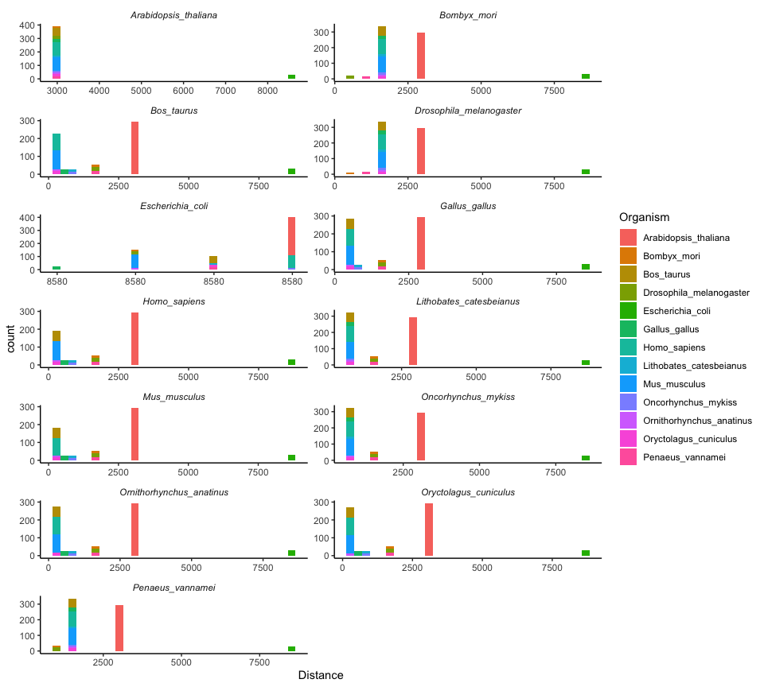
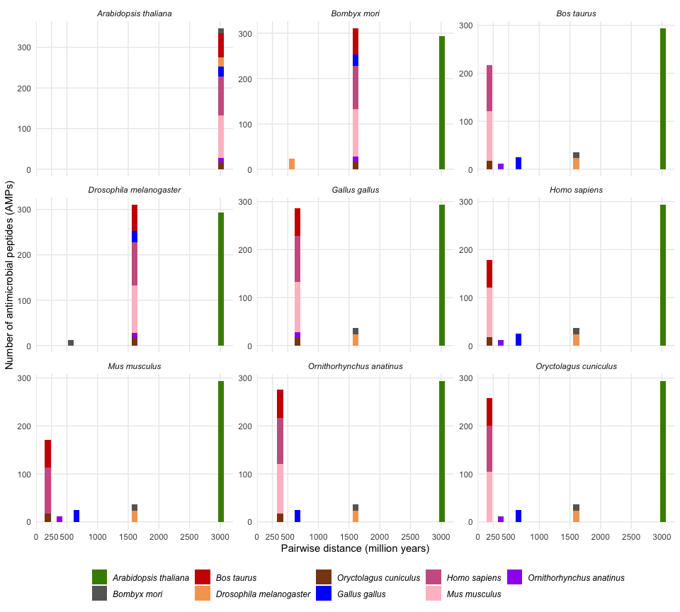
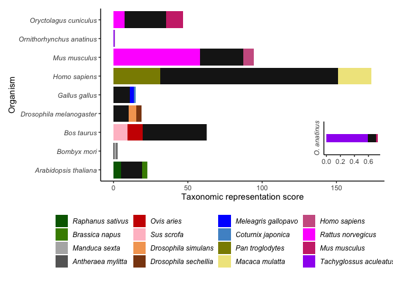
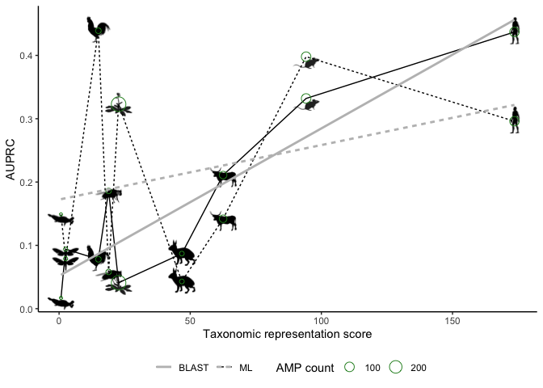

``` r
library(tidyverse)
library(ape)
library(treeio)
library(patchwork)
library(pals)
library(ggtext)
library(broom)
```

Read in AMP database to extract organisms from to submit to
[TimeTree](http://timetree.org/) for phylogenetic data.

``` r
amp_database <- readRDS("data/uniprot_amps_w_amp_dbsJuly21.rds") %>%
  rename(Entry_name = `Entry name`) %>% 
  mutate(Organism = str_remove(Organism, " \\(.*")) %>% 
  rename(Taxonomic_lineage = `Taxonomic lineage (ALL)`) %>% 
  rename(Order = `Taxonomic lineage (ORDER)`) %>% 
  rename(Phylum = `Taxonomic lineage (PHYLUM)`) %>%
  rename(Class = `Taxonomic lineage (CLASS)`) %>%
  mutate(Order = str_remove(Order, " \\(.*")) %>%
  filter(!grepl("Viruses", Taxonomic_lineage)) %>%
  filter(!grepl("\\.", Organism)) %>%
  mutate(Organism = word(Organism, 1, 2)) %>% 
  mutate(Organism = case_when(
    str_detect(Organism, "Phlyctimantis maculatus") ~ "Hylambates maculatus",
    str_detect(Organism, "Nyctimystes infrafrenatus") ~ "Litoria infrafrenata",
    str_detect(Organism, "Boana punctata") ~ "Hypsiboas punctatus",
                          TRUE ~ Organism)) %>%
  mutate(Organism = str_replace(Organism, "Ranoidea", "Litoria")) %>%
  mutate(Organism = str_replace_all(Organism, " ", "_")) %>%
  ungroup()


write_lines(unique(amp_database$Organism), "cache/amp_db_organism_list.txt")
```

There are a total of 788 organisms in this AMP database.

Read in the tree from [TimeTree](http://timetree.org/)

Normalise names: 221 organisms had unresolved names of which 81 were
replaced with different names and the remaining 140 organisms
potentially were not in the TimeTree database at the time.

``` r
timetree <- read.tree("data/amp_db_organism_list.nwk")

timetree_tibble <- as_tibble(timetree) %>%
   mutate(label = case_when(
    str_detect(label, "Halobacterium_salinarum") ~ "Haloarchaeon_S8a",
    str_detect(label, "_aerogenes") ~ "Klebsiella_pneumoniae",
    str_detect(label, "Achromobacter_denitrificans") ~ "Achromobacter_lyticus",
    str_detect(label, "Lactobacillus_casei") ~ "Lactobacillus_paracasei",
    str_detect(label, "Actinoplanes_missouriensis") ~ "Actinoplanes_garbadinensis",
    str_detect(label, "Agrocybe_praecox") ~ "Agrocybe_cylindracea",
    str_detect(label, "Coprinopsis_lagopus") ~ "Coprinopsis_cinerea",
    str_detect(label, "Ganoderma_sinense") ~ "Pleurotus_sajor-caju",
    str_detect(label, "Peziza_vesiculosa") ~ "Pseudoplectania_nigrella",
    str_detect(label, "Microascus_cirrosus") ~ "Pseudallescheria_apiosperma",
    str_detect(label, "Colletotrichum_acutatum") ~ "Colletotrichum_dematium",
    str_detect(label, "Penicillium_javanicum") ~ "Penicillium_rubens",
    str_detect(label, "Mucor_racemosus") ~ "Rhizomucor_pusillus",
    str_detect(label, "Schistosoma_japonicum") ~ "Schistosoma_mansoni",
    str_detect(label, "Molgula_tectiformis") ~ "Halocynthia_aurantium",
    str_detect(label, "Paralichthys_dentatus") ~ "Paralichthys_olivaceus",
    str_detect(label, "Siganus_vulpinus") ~ "Siganus_canaliculatus",
    str_detect(label, "Opsanus_tau") ~ "Thalassophryne_nattereri",
    str_detect(label, "Cynops_pyrrhogaster") ~ "Cynops_fudingensis ",
    str_detect(label, "Paracentrotus_lividus") ~ "Echinus_esculentus",
    str_detect(label, "Leptasterias_hexactis") ~ "Asterias_rubens",
    str_detect(label, "Scolopendra_cingulata") ~ "Scolopendra_subspinipes",
    str_detect(label, "Panulirus_interruptus") ~ "Panulirus_argus",
    str_detect(label, "Chionoecetes_opilio") ~ "Hyas_araneus",
    str_detect(label, "Anax_junius") ~ "Aeshna_cyanea",
    str_detect(label, "Anoplius_aethiops") ~ "Anoplius_samariensis",
    str_detect(label, "Osmia_lignaria") ~ "Osmia_rufa",
    str_detect(label, "Lasioglossum_calceatum") ~ "Lasioglossum_laticeps",
    str_detect(label, "Macropis_europaea") ~ "Macropis_fulvipes",
    str_detect(label, "Tetramorium_caespitum") ~ "Tetramorium_bicarinatum",
    str_detect(label, "Formica_moki") ~ "Formica_aquilonia",
    str_detect(label, "Odontomachus_clarus") ~ "Odontomachus_monticola",
    str_detect(label, "Polistes_tenebricosus") ~ "Polistes_hebraeus",
    str_detect(label, "Stizoides_foxi") ~ "Sphecius_speciosus ",
    str_detect(label, "Aleiodessp.BOLD") ~ "Pimpla_disparis",
    str_detect(label, "Circellium_bacchus") ~ "Copris_tripartitus",
    str_detect(label, "Osmoderma_eremita") ~ "Trypoxylus_dichotomus",
    str_detect(label, "Tetraopes_tetrophthalmus") ~ "Acalolepta_luxuriosa",
    str_detect(label, "Chrysolina_hyperici") ~ "Gastrophysa_atrocyanea",
    str_detect(label, "Culicoides_arakawae") ~ "Culicoides_sonorensis",
    str_detect(label, "Phlebotomus_papatasi") ~ "Phlebotomus_duboscqi",
    str_detect(label, "Sarcophaga_bullata") ~ "Sarcophaga_peregrina",
    str_detect(label, "Tinea_columbariella") ~ "Oiketicus_kirbyi",
    str_detect(label, "Manga_basilinea") ~ "Mamestra_brassicae",
    str_detect(label, "Heliothis_terracottoides") ~ "Heliothis_virescens",
    str_detect(label, "Saturnia_mendocino") ~ "Antheraea_mylitta",
    str_detect(label, "Accinctapubes_albifasciata") ~ "Galleria_mellonella",
    str_detect(label, "Aeschyntelus_notatus") ~ "Riptortus_clavatus",
    str_detect(label, "Brochymena_sp._WCW-2003") ~ "Podisus_maculiventris ",
    str_detect(label, "Platypleura_capensis") ~ "Cicada_flammata",
    str_detect(label, "Cryptotympana_atrata") ~ "Cryptotympana_dubia",
    str_detect(label, "Acyrthosiphon_pisum") ~ "Megoura_viciae",
    str_detect(label, "Ixodes_hexagonus") ~ "Ixodes_sinensis",
    str_detect(label, "Rhipicephalus_sanguineus") ~ "Rhipicephalus_microplus",
    str_detect(label, "Ornithodoros_moubata") ~ "Argas_monolakensis",
    str_detect(label, "Loxosceles_laeta") ~ "Loxosceles_gaucho",
    str_detect(label, "Lycosa_tarantula") ~ "Oxyopes_takobius",
    str_detect(label, "Vaejovis_bandido") ~ "Mesomexovis_subcristatus",
    str_detect(label, "Metaphire_sieboldi") ~ "Metaphire_guillelmi",
    str_detect(label, "Poecilobdella_manillensis") ~ "Hirudo_medicinalis",
    str_detect(label, "Nereis_denhamensis") ~ "Perinereis_aibuhitensis",
    str_detect(label, "Capitella_teleta") ~ "Arenicola_marina",
    str_detect(label, "Conus_purpurascens") ~ "Conus_mustelinus",
    str_detect(label, "Globba_radicalis") ~ "Curcuma_longa",
    str_detect(label, "Xanthosoma_helleborifolium") ~ "Xanthosoma_sagittifolium",
    str_detect(label, "Macadamia_tetraphylla") ~ "Macadamia_integrifolia",
    str_detect(label, "Brassica_rapa") ~ "Brassica_campestris",
    str_detect(label, "Cucurbita_pepo") ~ "Cucurbita_maxima",
    str_detect(label, "Inga_cf._edulis_Klitgaard_677") ~ "Inga_vera",
    str_detect(label, "Parkia_timoriana") ~ "Parkia_pendula",
    str_detect(label, "Cullen_australasicum") ~ "Cullen_corylifolium",
    str_detect(label, "Arachis_major") ~ "Arachis_hypogaea",
    str_detect(label, "Heuchera_merriamii") ~ "Heuchera_sanguinea",
    str_detect(label, "Portulaca_grandiflora") ~ "Basella_alba",
    str_detect(label, "Amaranthus_palmeri") ~ "Amaranthus_caudatus ",
    str_detect(label, "Bidens_cernua") ~ "Dahlia_merckii",
    str_detect(label, "Geophila_obvallata") ~ "Chassalia_chartacea ",
    str_detect(label, "Psychotria_kirkii") ~ "Psychotria_longipes",
    str_detect(label, "Lippia_javanica") ~ "Lippia_sidoides",
    str_detect(label, "Diospyros_cavalcantei") ~ "Diospyros_texana",
    str_detect(label, "_gnavus") ~ "Ruminococcus_gnavus",
    str_detect(label, "Mycobacterium_phlei") ~ "Mycolicibacterium_phlei",
    str_detect(label, "Kassina_maculata") ~ "Hylambates_maculatus",
    str_detect(label, "Rana_septentrionalis") ~ "Lithobates_septentrionalis",
    str_detect(label, "Rana_sevosa") ~ "Lithobates_sevosus",
    str_detect(label, "Rana_clamitans") ~ "Lithobates_clamitans",
    str_detect(label, "Rana_berlandieri") ~ "Lithobates_berlandieri",
    str_detect(label, "Rana_sphenocephala") ~ "Lithobates_sphenocephalus",
    str_detect(label, "Rana_palustris") ~ "Lithobates_palustris",
    str_detect(label, "Rana_pipiens") ~ "Lithobates_pipiens",
    str_detect(label, "Rana_sylvatica") ~ "Lithobates_sylvaticus",
    str_detect(label, "Rana_catesbeiana") ~ "Lithobates_catesbeianus",
    str_detect(label, "Rugosa_rugosa") ~ "Nidirana_pleuraden",
    str_detect(label, "Babina_okinavana") ~ "Glandirana_rugosa",
    str_detect(label, "Babina_pleuraden") ~ "Nidirana_pleuraden",
    str_detect(label, "Eupemphix_nattereri") ~ "Physalaemus_nattereri",
    str_detect(label, "Hypsiboas_albopunctatus") ~ "Boana_albopunctata",
    str_detect(label, "Phyllomedusa_sauvagii") ~ "Phyllomedusa_sauvagei",
    str_detect(label, "Phyllomedusa_hypochondrialis") ~ "Pithecopus_hypochondrialis",
    str_detect(label, "Phyllomedusa_oreades") ~ "Pithecopus_oreades",
    str_detect(label, "Pachymedusa_dacnicolor") ~ "Agalychnis_dacnicolor",
    str_detect(label, "Hylomantis_lemur") ~ "Agalychnis_lemur",
    str_detect(label, "Cercopithecus_preussi") ~ "Allochrocebus_preussi",
    str_detect(label, "Fenneropenaeus_merguiensis") ~ "Penaeus_merguiensis",
    str_detect(label, "Litopenaeus_vannamei") ~ "Penaeus_vannamei",
    str_detect(label, "Litopenaeus_setiferus") ~ "Penaeus_setiferus",
    str_detect(label, "Neobellieria_bullata") ~ "Sarcophaga_peregrina",
    str_detect(label, "Chaetomium_elatum") ~ "Chaetomium_globosum",
    str_detect(label, "Sylvirana_latouchii") ~ "Hylarana_latouchii",
    str_detect(label, "Heliophila_hurkana") ~ "Heliophila_coronopifolia",
                          TRUE ~ label)) %>%
  mutate(label = str_trim(label, side = "right")) # remove trailing whitespace
```

``` r
treelabel_notinAMPs <- timetree_tibble[!timetree_tibble$label %in% amp_database$Organism,]

AMPs_notintreelabel <- amp_database[!amp_database$Organism %in% timetree_tibble$label,]
```

After renaming the majority of species in the tree to match to the
species names used in the AMP database, 472 AMP entries corresponding to
140 organisms remained in SwissProt where the species could not be found
in the TimeTree database. These mostly includes arachnids (scorpions and
spiders), hymenopterans (wasps, bees, ants and sawflies) and anurans
(frogs).

``` r
AMPs_notintreelabel %>% count(Order, sort = TRUE)
```

    ## # A tibble: 37 × 2
    ##    Order               n
    ##    <chr>           <int>
    ##  1 Scorpiones         98
    ##  2 Hymenoptera        91
    ##  3 Anura              83
    ##  4 Araneae            67
    ##  5 Lepidoptera        15
    ##  6 Coleoptera         13
    ##  7 Stolidobranchia    13
    ##  8 Lactobacillales    11
    ##  9 Fabales             9
    ## 10 Poales              9
    ## # … with 27 more rows

Convert the tree tibble back to a tree

``` r
timetree_reworded <- as.treedata(timetree_tibble)

timetree_reworded_phylo <- timetree_reworded@phylo
```

## Pairwise distances between organisms

Calculate pairwise distances between pairs of tips from the tree using
the branch lengths with
[`cophenetic.phylo`](https://rdrr.io/cran/ape/man/cophenetic.phylo.html)

``` r
timetree_distance_matrix <- cophenetic.phylo(timetree_reworded_phylo)
```

Convert matrix to dataframe and left join to AMP database (by organism).

Convert matrix to dataframe, tidy it, and left join to the AMP database
(by organism). This results in a long tibble with two columns that
contain organism names. Each row represents the potential contribution
of an AMP (from one organism) to the database of AMPs available for
training models that could potentially be used to predict amps in a
second organism. In this framework we refer to the first organism using
the column `Organism` and the second using the column, `Target`.

``` r
timetree_dm_df <- as.data.frame(timetree_distance_matrix) %>% 
  rownames_to_column("Organism") %>% 
  pivot_longer(-Organism, names_to = "Target", values_to = "Distance")

amps_w_distance <- amp_database %>%
  left_join(timetree_dm_df, by = "Organism")
```

<!-- -->

**Figure 7.1:** **A** Histogram of pairwise distance between each
faceted organism and other selected organisms present in the AMP dataset

<!-- -->

**Figure 7.1.2** Histogram of pairwise distance between each faceted
organism and other selected organisms present in the AMP dataset

## Taxonomic distance score

The sigmoid value indicates the weighting of how close or far away an
AMP is. The parameter can be adjusted to change the inflection point. s
is the width of the curve The sigmoid curve equation is supposed to
represent the importance of taxonomic distance and its effect on the
performance of AMP finding methods. The limits of this is that organisms
that are taxonomically far away are less valuable. The extreme low end
of the curve reflects a low weighting, i.e. close to 0, for AMPs and
AMPs that are very close together, have a high rating. The curve goes
between those two extremes while still maintaining its sigmoid shape.

the current range is 1:300 which is a fairly close taxonomic distance

``` r
distance_score <- function(d, s){
  s/(s + exp(d/s))
}

x <- 1:300
plot(x, distance_score(x, 30))
```

<!-- -->

**Figure 7.2:** Sigmoid curve with an s parameter of 30

``` r
amps_w_distance_sum <- amps_w_distance %>%  
  filter(Organism != Target) %>% 
  select(Organism, Target, Distance) %>% 
  group_by(Organism, Target) %>% 
  summarise(AMP_count = n(), dscore = sum(distance_score(Distance, 30))) %>% 
  ungroup() 

top_2 <- amps_w_distance_sum %>% group_by(Target) %>% 
  mutate(Organism = str_replace_all(Organism, "_", " ")) %>% 
  mutate(Target = str_replace_all(Target, "_", " ")) %>% 
  filter(Target %in% organism_strict_selection) %>% 
  slice_max(dscore, n = 2, with_ties = FALSE) %>% 
  mutate(Organism2 = Organism)

all_rows <- amps_w_distance_sum %>% group_by(Target) %>% 
  mutate(Organism = str_replace_all(Organism, "_", " ")) %>% 
  mutate(Target = str_replace_all(Target, "_", " ")) %>% 
  filter(Target %in% organism_strict_selection) %>% 
  mutate(Organism2 = Organism)

amps_distance_grouped <- setdiff(all_rows, top_2) %>% 
  mutate(Organism2 = "Other") %>% 
  rbind(top_2)

colours = c("Raphanus sativus" = "darkgreen", "Brassica napus" = "chartreuse4", "Manduca sexta" = "grey70", "Antheraea mylitta" = "grey40", "Ovis aries" = "red3", "Sus scrofa" = "pink", "Drosophila simulans" = "sandybrown", "Drosophila sechellia" = "chocolate4", "Meleagris gallopavo" = "blue", "Coturnix japonica" = "steelblue3", "Pan troglodytes" = "yellow4", "Macaca mulatta" = "khaki", "Homo sapiens" = "hotpink3", "Rattus norvegicus" = "magenta", "Mus musculus" = "violetred3", "Tachyglossus aculeatus" = "purple", "Other" = "grey10")
```

``` r
all_organisms <- ggplot(amps_distance_grouped, aes(x = Target)) + 
  geom_col(aes(y = dscore, fill = Organism2)) + 
  coord_flip() +
  labs(y = "Taxonomic representation score", x = "Organism", fill = "") +
  theme_classic() +
  theme(legend.position = "bottom",
        axis.text.y = element_text(face = "italic")) +
  guides(fill = guide_legend(label.theme = element_text(face = "italic", size = 9))) +
  scale_fill_manual(values = colours)

platypus <- ggplot(filter(amps_distance_grouped, Target == "Ornithorhynchus anatinus"), aes(x = Target)) + 
  geom_col(aes(y = dscore, fill = Organism2), width = 0.3) + 
  coord_flip() +
  labs(y = "", x = "", fill = "") +
  theme_classic() +
  theme(legend.position = "none",
        axis.text.y = element_text(angle = 90, vjust = 0.5, hjust = 0.5, face = "italic"),
        axis.ticks.y = element_blank()) +
  guides(fill = guide_legend(label.theme = element_text(face = "italic", size = 9))) +
  scale_fill_manual(values = colours[15:17]) +
  scale_x_discrete(labels = "O. anatinus")

all_organisms + inset_element(platypus, left = 0.7, bottom = 0.01, right = 1, top = 0.37)
```

<!-- -->

**Figure 7.3:** The contributions of different species to the taxonomic
representation score of the selected organisms. Only the two species
with the largest contributions are shown. The contribution of the
remaining species were amalgamated into the “other” category.
*Ornithorhynchus anatinus* is displayed as a zoomed in inset plot near
the bottom right of the main plot.

## Taxonomic distance score vs. AUPRC

Sum the distance score and filter out the selected organisms. The sum of
the distance score equals the taxonomic representation of AMPs in the
AMP dataset

``` r
distance_metric <- amps_w_distance_sum %>% 
  group_by(Target) %>% 
  summarise(score = sum(dscore,na.rm = TRUE)) %>%
  rename(Organism = Target) %>% 
  filter(Organism %in% organism_selection)
```

Read in previously calculated AUPRC values (see
03\_blast\_and\_prediction.Rmd) for the 13 organisms whose AMP count
refer to AMPs in their respective proteomes found via the UniProt
“Antimicrobial” keyword, and for the nine organisms, whose AMP count
refer to AMPs in their respective proteomes that overlap with the AMPs
in the AMP database.

``` r
methods_auprc_13_wide_w_count <- readRDS("cache/methods_auprc13_w_totalAMPs_wide.rds")
methods_auprc_9_wide_w_count <- readRDS("cache/methods_auprc9_w_totalAMPs_wide.rds")
```

Add the distance metric to the performance and AMP count datasets

``` r
auprc_and_distance_metric_wAMPcount_13 <- left_join(methods_auprc_13_wide_w_count, distance_metric, by = "Organism")
auprc_and_distance_metric_wAMPcount_9 <- left_join(methods_auprc_9_wide_w_count, distance_metric, by = "Organism")
```

**Table 7.4:** The distance metric and the AUPRC for the classification
and BLAST methods for 13 organisms with their respective AMP count
present in their proteomes

| Organism                  | Classification | BLAST | Total\_AMPs\_in\_test |       score |
|:--------------------------|---------------:|------:|----------------------:|------------:|
| Mus\_musculus             |          0.365 | 0.305 |                   132 |  94.1821476 |
| Homo\_sapiens             |          0.286 | 0.391 |                   116 | 173.6028581 |
| Bos\_taurus               |          0.370 | 0.299 |                   117 |  62.5405555 |
| Oryctolagus\_cuniculus    |          0.220 | 0.205 |                    83 |  46.8024558 |
| Ornithorhynchus\_anatinus |          0.157 | 0.097 |                    27 |   0.7305478 |
| Gallus\_gallus            |          0.435 | 0.121 |                    30 |  14.9801548 |
| Oncorhynchus\_mykiss      |          0.071 | 0.108 |                    17 |   1.1760262 |
| Drosophila\_melanogaster  |          0.053 | 0.193 |                    33 |  18.8882984 |
| Penaeus\_vannamei         |          0.014 | 0.064 |                     3 |   5.5749552 |
| Bombyx\_mori              |          0.065 | 0.140 |                    25 |   2.4862826 |
| Arabidopsis\_thaliana     |          0.318 | 0.041 |                   296 |  22.6949207 |
| Lithobates\_catesbeianus  |          0.022 | 0.214 |                    12 | 187.3398440 |
| Escherichia\_coli         |          0.227 | 0.500 |                     4 |   1.0450033 |

**Table 7.5:** The distance metric and the AUPRC for the classification
and BLAST methods for 9 organisms with their respective AMP count
present in their proteomes which also overlap with the AMPs in the AMP
database

| Organism                  | Classification | BLAST | Total\_AMPs\_in\_test |       score |
|:--------------------------|---------------:|------:|----------------------:|------------:|
| Mus\_musculus             |          0.398 | 0.332 |                    99 |  94.1821476 |
| Homo\_sapiens             |          0.296 | 0.437 |                    95 | 173.6028581 |
| Bos\_taurus               |          0.142 | 0.211 |                    54 |  62.5405555 |
| Oryctolagus\_cuniculus    |          0.043 | 0.087 |                    17 |  46.8024558 |
| Ornithorhynchus\_anatinus |          0.149 | 0.017 |                    11 |   0.7305478 |
| Gallus\_gallus            |          0.439 | 0.078 |                    25 |  14.9801548 |
| Drosophila\_melanogaster  |          0.058 | 0.186 |                    23 |  18.8882984 |
| Bombyx\_mori              |          0.079 | 0.094 |                    13 |   2.4862826 |
| Arabidopsis\_thaliana     |          0.323 | 0.041 |                   291 |  22.6949207 |

Change back to long format for plotting

``` r
auprc_and_distance_metric_long_13 <- auprc_and_distance_metric_wAMPcount_13 %>% 
  pivot_longer(cols = c(Classification, BLAST), names_to = "Method", values_to = "AUPRC")

auprc_and_distance_metric_long_9 <- auprc_and_distance_metric_wAMPcount_9 %>% 
  pivot_longer(cols = c(Classification, BLAST), names_to = "Method", values_to = "AUPRC")
```

Images were obtained from [phylopic.org](http://phylopic.org/) all
images used were dedicated to the [public
domain](https://creativecommons.org/publicdomain/zero/1.0/) and are not
copyrighted.

``` r
link_to_img <- function(x, size = 25) {
  paste0("")
}
  
auprcplot_img_13 <- auprc_and_distance_metric_wAMPcount_13 %>%
  mutate(images = link_to_img(pics13)) %>% 
  filter(Organism != "Escherichia_coli") %>%
  filter(Organism != "Penaeus_vannamei") %>% 
  pivot_longer(cols = c(Classification, BLAST), names_to = "Method", values_to = "AUPRC") %>%
  ggplot(aes(x = score, y = AUPRC, label = images)) +
  geom_richtext(fill = NA, label.color = NA) +
  geom_line(aes(linetype = Method)) +
  geom_point(aes(size = Total_AMPs_in_test), colour = "forestgreen", shape = 1) +
  theme_classic() +
  theme(legend.position = "none") +
  labs(x = "Taxonomic representation score", linetype = "")


auprcplot_img_9 <- auprc_and_distance_metric_wAMPcount_9 %>%
  mutate(images = link_to_img(pics9)) %>% 
  pivot_longer(cols = c(Classification, BLAST), names_to = "Method", values_to = "AUPRC") %>%
  ggplot(aes(x = score, y = AUPRC, label = images)) +
  geom_richtext(fill = NA, label.color = NA) +
  geom_line(aes(linetype = Method)) +
  geom_point(aes(size = Total_AMPs_in_test), colour = "forestgreen", shape = 1) +
  theme_classic() +
  theme(legend.position = "bottom") +
  labs(x = "Taxonomic representation score", linetype = "", size = "AMP count")
```

<!-- -->

**Figure 7.7** The perforrnce of BLAST and classification models
measured in Area under the Precision-Recall curve (AUPRC) in finding
AMPs in the proteomes of **A)** 11 organisms where AMPs were labelled as
AMPs exclusively by using the “Antimicrobial” keyword from UniProt and
**B** nine organisms where AMPs were labelled as AMPs if annotated with
the UniProt “Antimicrobial” keyword **and** if these AMPs overlapped
with the AMP database generated from SwissProt and the APD, DRAMP or
dbAMP databases.

### Correlation analysis

For the stricter method with 9 organisms using a sigmoid-value of 30:

``` r
cor.test(~ BLAST + score, data = auprc_and_distance_metric_wAMPcount_9, method = "spearman" )
```

    ## 
    ##  Spearman's rank correlation rho
    ## 
    ## data:  BLAST and score
    ## S = 26, p-value = 0.01722
    ## alternative hypothesis: true rho is not equal to 0
    ## sample estimates:
    ##       rho 
    ## 0.7833333

``` r
cor.test(~ Classification + score, data = auprc_and_distance_metric_wAMPcount_9, method = "spearman" )
```

    ## 
    ##  Spearman's rank correlation rho
    ## 
    ## data:  Classification and score
    ## S = 104, p-value = 0.7435
    ## alternative hypothesis: true rho is not equal to 0
    ## sample estimates:
    ##       rho 
    ## 0.1333333

``` r
cor.test(~ Classification + score, data = auprc_and_distance_metric_wAMPcount_9, method = "kendall" )
```

    ## 
    ##  Kendall's rank correlation tau
    ## 
    ## data:  Classification and score
    ## T = 19, p-value = 0.9195
    ## alternative hypothesis: true tau is not equal to 0
    ## sample estimates:
    ##        tau 
    ## 0.05555556

``` r
auprc_and_distance_metric_wAMPcount_9 %>%
  mutate(images = link_to_img(pics9)) %>% 
  pivot_longer(cols = c(Classification, BLAST), names_to = "Method", values_to = "AUPRC") %>%
  ggplot(aes(x = score, y = AUPRC, label = images)) +
  geom_richtext(fill = NA, label.color = NA) +
  geom_line(aes(linetype = Method)) +
  geom_point(aes(size = Total_AMPs_in_test), colour = "forestgreen", shape = 1) +
  geom_smooth(method = lm, se = FALSE,
              aes(linetype = Method), colour = "grey") +
  theme_classic() +
  theme(legend.position = "bottom") +
  labs(x = "Taxonomic representation score", linetype = "", size = "AMP count")
```

<!-- -->

**Figure 7.8:** linear regression lines of the AMP finding methods in a
range of organisms

### Testing the effect of different sigmoid values on the taxonomic distance score

``` r
s_5 <- data.frame(x = 1:30, distance_score_value = distance_score(1:30, 5), s = 5)
s_20 <- data.frame(x = 1:200, distance_score_value = distance_score(1:200, 20), s = 20)
s_30 <- data.frame(x = 1:300, distance_score_value = distance_score(1:300, 30), s = 30)
s_50 <- data.frame(x = 1:500, distance_score_value = distance_score(1:500, 50), s = 50)
s_100 <- data.frame(x = 1:1000, distance_score_value = distance_score(1:1000, 100), s = 100)
s_1000 <- data.frame(x = 1:15000, distance_score_value = distance_score(1:15000, 1000), s = 1000)

s_curves <- rbind(s_5, s_20, s_30, s_50, s_100, s_1000)

ggplot(s_curves, aes(x = x, y = distance_score_value)) +
         geom_line() +
         facet_wrap(~s, scales = "free_x") +
         labs(x = "Pairwise distance", y = "Distance score") + 
         theme_minimal() +
         theme(panel.grid.minor = element_blank(),
               plot.background = element_rect(fill = "white", colour = "white"))
```

<!-- -->

**Figure 7.9.1:** Sigmoid curves with different s parameters

``` r
amps_w_distance_s_curves_function <- function(s_value) {
  amps_w_distance %>%  
  filter(Organism != Target) %>% 
  select(Organism, Target, Distance) %>% 
  group_by(Organism, Target) %>% 
  summarise(AMP_count = n(), dscore = sum(distance_score(Distance, s_value))) %>% 
  add_column(s_value) %>% 
  ungroup() %>% 
  mutate(Target = str_replace_all(Target, "_", " ")) %>% 
  filter(Target %in% organism_strict_selection)
}

amps_w_distance_s5 <- amps_w_distance_s_curves_function(5)
amps_w_distance_s20 <- amps_w_distance_s_curves_function(20)
amps_w_distance_s30 <- amps_w_distance_s_curves_function(30)
amps_w_distance_s50 <- amps_w_distance_s_curves_function(50)
amps_w_distance_s100 <- amps_w_distance_s_curves_function(100)
amps_w_distance_s1000 <- amps_w_distance_s_curves_function(1000)

amps_w_distance_all_curves <- rbind(amps_w_distance_s5, amps_w_distance_s20, amps_w_distance_s30, amps_w_distance_s50, amps_w_distance_s100, amps_w_distance_s1000)


ggplot(amps_w_distance_all_curves, aes(x = Target)) + 
  geom_col(aes(y = dscore)) + 
  coord_flip() +
  facet_wrap(~s_value, scales = "free_x") +
  labs(y = "Taxonomic representation score", x = "Organism", fill = "") +
  theme_classic() +
  theme(legend.position = "bottom",
        axis.text.y = element_text(face = "italic"),
        strip.background = element_rect(fill = NA, color = NA),
        strip.text.x = element_text(face = "bold", size = 13))
```

<!-- -->

**Figure 7.9.2:** The effect of different sigmoid values on the
taxonomic representation score using a selection of organisms

Testing the different sigmoid values to see how it affects the final
conclusion (based on the p-value of the spearman’s correlation test )

``` r
performance_results <- methods_auprc_9_wide_w_count %>% 
  mutate(Organism = str_replace_all(Organism, "_", " "))

p_cor_classification_blast <- function(amps_w_distance_df, method_type1, method_type2) {
  
  
  df_join1 <- amps_w_distance_df %>% 
  group_by(Target) %>% 
  summarise(score = sum(dscore,na.rm = TRUE)) %>% 
  rename(Organism = Target) %>% 
  left_join(performance_results, by = "Organism") 
  
 res1 <- tidy(cor.test(~ Classification + score, data = df_join1, method = "spearman")) %>% 
  add_column(Method = method_type1)

  df_join2 <- amps_w_distance_df %>% 
  group_by(Target) %>% 
  summarise(score = sum(dscore,na.rm = TRUE)) %>% 
  rename(Organism = Target) %>% 
  left_join(performance_results, by = "Organism") 
  
 res2 <- tidy(cor.test(~ BLAST + score, data = df_join2, method = "spearman")) %>% 
  add_column(Method = method_type2)
  
  rbind(res1, res2) %>% 
    rename(rho = estimate) %>% 
    select(-alternative, -method) %>% 
    mutate(Significant = p.value <= 0.05 )

}

p_cor_5 <- p_cor_classification_blast(amps_w_distance_s5, "Classification_s5", "BLAST_s5" )
p_cor_20 <- p_cor_classification_blast(amps_w_distance_s20, "Classification_s20", "BLAST_s20")
p_cor_30 <- p_cor_classification_blast(amps_w_distance_s30, "Classification_s30", "BLAST_s30")
p_cor_50 <- p_cor_classification_blast(amps_w_distance_s50, "Classification_s50", "BLAST_s50")
p_cor_100 <- p_cor_classification_blast(amps_w_distance_s100, "Classification_s100", "BLAST_s100")
p_cor_1000 <- p_cor_classification_blast(amps_w_distance_s100, "Classification_s1000", "BLAST_s1000")

p_cor_all <- rbind(p_cor_5, p_cor_20, p_cor_30, p_cor_50, p_cor_100, p_cor_1000)
```

**Table 7.1:** The effect of using different s-values on the spearman’s
correlation tests measuring the relationship between the performance of
BLAST and Classification methods and the taxonomic representation score

|   rho | statistic | p.value | Method                | Significant |
|------:|----------:|--------:|:----------------------|:------------|
|  0.23 |        92 |    0.55 | Classification\_s5    | FALSE       |
|  0.67 |        40 |    0.06 | BLAST\_s5             | FALSE       |
|  0.33 |        80 |    0.39 | Classification\_s20   | FALSE       |
|  0.77 |        28 |    0.02 | BLAST\_s20            | TRUE        |
|  0.13 |       104 |    0.74 | Classification\_s30   | FALSE       |
|  0.78 |        26 |    0.02 | BLAST\_s30            | TRUE        |
|  0.00 |       120 |    1.00 | Classification\_s50   | FALSE       |
|  0.60 |        48 |    0.10 | BLAST\_s50            | FALSE       |
| -0.08 |       130 |    0.84 | Classification\_s100  | FALSE       |
|  0.30 |        84 |    0.44 | BLAST\_s100           | FALSE       |
| -0.08 |       130 |    0.84 | Classification\_s1000 | FALSE       |
|  0.30 |        84 |    0.44 | BLAST\_s1000          | FALSE       |

#### Terminology

Distance score: it will give a high score when the distance taxonomic
distance is low. All taxonomic distances are converted into this score
and it is added up to become the taxonomic representation score.
Therefore, a high taxonomic representation score means that organism is
well represented in the database.

Taxonomic distance: raw distance Distance score: the taxonomic distance
that is converted with the sigmoid curve Taxonomic representation score:
the sum of the distance score

Value 30: Width parameter (of the sigmoid curve)
